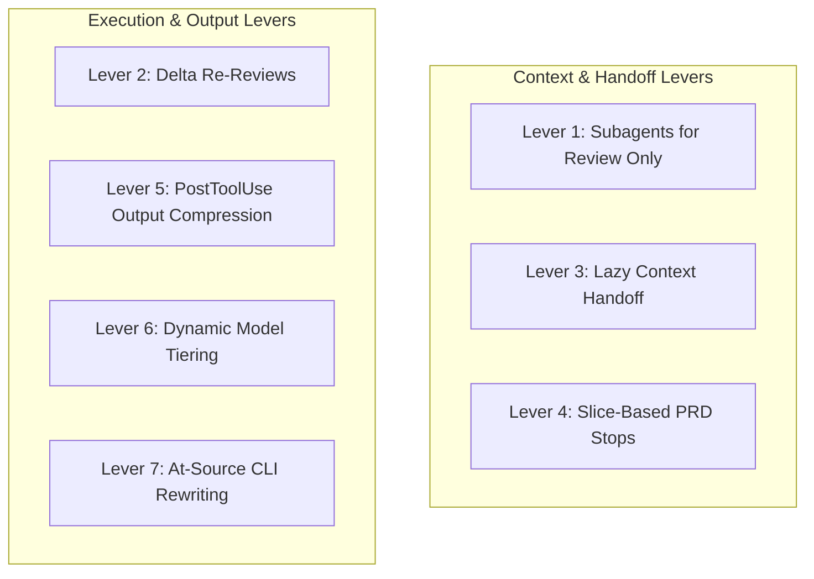

# Auto-Tiering and Token Cost Discipline Architecture

> [!abstract] TL;DR
> The **Auto-Tiering and Token Cost Discipline Architecture** keeps AI token expenditure strictly proportional to the scope, diff size, and safety risk of a software change. By combining **signal-based auto-tiering** (DIRECT, LEAN, FULL) with **seven core cost-reduction levers** (isolated reviewers only, delta re-reviews, lazy context handoff, slice-based PRD stops, output compression, model tiering, and at-source CLI rewriting), the harness achieves **60–90% token savings** over naive multi-agent workflows while preserving non-negotiable safety and quality guarantees.

---

## 1. The Cost Dilemma & Philosophy

Naively orchestrating multi-agent engineering workflows—where every task spawns multiple isolated agents for planning, building, reviewing, testing, and copyediting—results in exponential token consumption. A simple 10-line bug fix can easily consume hundreds of thousands of tokens due to redundant context cold-starts.

The harness solves this with a clear governing philosophy:
> **Spend tokens proportional to the risk and scope of the change. Only reviewing and safety-judging require an isolated context; building, refactoring, and test execution are far cheaper in the main session.**

```
                               ┌─────────────────────────────┐
                               │  Incoming Ticket / Request  │
                               └──────────────┬──────────────┘
                                              │
                                              ▼
┌────────────────────────────────────────────────────────────────────────────────────────┐
│                        Signal-Based Auto-Tiering Engine                                │
│   Evaluates: Work Lane · Safety Flag (§5) · Module Count · Rule Count · Diff Size      │
└──────────────┬──────────────────────────────┬───────────────────────────┬──────────────┘
               │                              │                           │
               ▼                              ▼                           ▼
┌─────────────────────────────┐┌──────────────────────────────┐┌──────────────────────────┐
│         DIRECT TIER         ││          LEAN TIER           ││        FULL TIER         │
│ • Main Session Only         ││ • Main Session Builder       ││ • Paired Fan-Out         │
│ • No Subagents              ││ • 1 Isolated Reviewer        ││ • Architecture Plan Doc  │
│ • Near-Zero Overhead        ││ • Independent Safety Veto    ││ • Full Subagent Matrix   │
└─────────────────────────────┘└──────────────────────────────┘└──────────────────────────┘
```

---

## 2. Signal-Based Auto-Tiering Engine

The auto-tiering engine determines execution rigor in two steps: **Work-Type Lane Classification** followed by **Signal Evaluation**.

### 1. Work-Type Lanes
Tickets are categorized into lanes (`app-feature`, `internal-tool`, `integration`, `dashboard`, `data-pull`, `bugfix`, `research`, `design`). The lane defines which pipeline components run:
* `app-feature`: Full flag-ramped pipeline + E2E + experiment bundle.
* `internal-tool` / `integration`: LEAN build skipping feature flags and experiments.
* `dashboard` / `data-pull`: Data correctness discipline (`analytics-engineer` + privacy sign-off).
* `bugfix`: Direct targeted fix pipeline.

### 2. Signal Evaluation & Tier Selection (`implement`)
Within code lanes, `implement` inspects concrete signals: Product Rule counts, safety surface declarations (`.claude/project-profile.md §5`), module counts, INVEST slice counts, and **estimated diff size (lines + file count)**:

| Tier | Signal Criteria | Execution Strategy | Cost Profile |
| :--- | :--- | :--- | :--- |
| **DIRECT** | No rules · No safety surface · $\le ~2$ files | Edit directly in main session; zero subagent cold-starts. | Minimal ($\sim 1\times$) |
| **LEAN** *(Default)* | Rule-bearing or safety surface, single discipline — **OR small multi-discipline change** ($\le ~80$ lines / $\le ~6$ files) | Build in main session + **one** isolated independent reviewer subagent per discipline (+ safety reviewer if safety surface). | Low ($\sim 2\text{--}3\times$) |
| **FULL** | Multi-discipline **AND** large/risky diff ($> ~80$ lines / $> ~6$ files) / non-trivial safety surface | Paired-review fan-out orchestration, auto-preceded by a reviewed architecture plan doc. | Standard ($\sim 6\text{--}10\times$) |

> [!NOTE]
> **Diff Size Circuit Breaker**: Spanning multiple disciplines does *not* force a jump to FULL if the change is small ($\le ~80$ lines). A small multi-discipline change remains LEAN, running the Lean procedure once per discipline in contract order (`db → be → fe`).

---

## 3. The 7 Core Levers of Token Cost Discipline



### Lever 1: Isolated Subagents for Review Only
A builder agent cold-starting in a subagent re-reads context the main session already holds. To eliminate this duplication, **builders operate directly in the main session**. Only **reviewers and safety judges** spawn in isolated subagents, guaranteeing uncompromised cognitive independence without wasting builder cold-start tokens.

### Lever 2: Round 1 Full vs. Round 2+ Delta Re-Reviews
When a reviewer finds issues during Beat C (`implement`), the implementer fixes them. 
* **Round 1**: The reviewer performs a full audit of the complete diff against Product Rules and design tokens.
* **Rounds 2+**: The reviewer inspects **only modified lines (deltas)**. Context from unchanged lines is not re-processed.

### Lever 3: Lazy Context & Scope Handoff
Commands (`pickup`, `define`, `implement`) extract relevant file paths, acceptance criteria, and draft REQs during initial execution and pass them **directly into agent prompts**. Agents do not waste tokens re-discovering context or searching directories.

### Lever 4: Vertical Slice PRD Stops
PRDs authored during `/define` stop at **vertical slices and testable acceptance criteria**. Enumerating file-level tasks or code snippets during the spec stage is strictly forbidden, preventing PRD documents from becoming bloated.

### Lever 5: PostToolUse Output Filter (`compress-bash-output.js`)
Command outputs from bash executions (such as `git log`, `git diff`, test runners, and build logs) are intercepted before entering the model's context window:
* Truncates outputs exceeding **250 lines** or **16,000 bytes**.
* Preserves the top **120 lines** (head) and bottom **80 lines** (tail, where test failures and summaries reside).
* Inserts a clear breadcrumb: `... [X lines omitted by output filter — head 120 + tail 80 shown] ...`.

### Lever 6: Dynamic Model Tiering
Model selection matches the cognitive complexity of each role:
* **Opus**: High-judgment, safety veto, adversarial review, and spec-review personas (`safety-reviewer`, `prd-reviewer`, `security-engineer`, `privacy-counsel`).
* **Sonnet**: Implementation and authoring personas (`fe-implementer`, `be-implementer`, `prd-author`).
* **Haiku**: Mechanical linters, formatters, and structural check skills (`spec-rule-check`, `design-token-check`).

### Lever 7: At-Source CLI Command Rewriting (`rtk-rewrite.js`)
Integrates with token-optimized CLI proxies (`rtk` - Rust Token Killer). When `rtk` is present, a PreToolUse hook transparently rewrites standard commands (e.g., `git status` $\rightarrow$ `rtk git status`, `npm test` $\rightarrow$ `rtk npm test`), reducing stdout token footprint by **60–90% at source**.

---

## 4. Opt-In Max Quality Escape Hatch (`quality-max`)

For critical infrastructure, core security refactoring, or major architectural milestones where quality takes absolute precedence over token spend:
* **Configuration**: Set `quality-max` preset in `.claude/project-profile.md §9` or pass `--quality-max`.
* **Behavior**: Pins **Opus across all roles** (builders, reviewers, spec authors) and sets reasoning effort to extra-high on planning and review passes.
* **Safety Floor Guarantee**: `quality-max` only ever *raises* model tiers; it never alters execution gates or safety veto mechanics.

---

## 5. Historical Cost Measurement Optics

The harness decouples cost tracking from core execution hooks to avoid unnecessary overhead:
* **`cost-tracker.js`**: An opt-in tracking utility (`HARNESS_COST_ENABLE=1`).
* When enabled, it records token usage to `.harness/cost.jsonl`.
* By default, it is **not registered as a Stop hook**, keeping default workflows lightweight.

---

## 6. Summary Matrix: Cost Optimization vs. Quality Guarantees

| Mechanism | Primary Cost Benefit | Quality / Safety Preservation |
| :--- | :--- | :--- |
| **DIRECT Tier** | Zero subagent overhead ($\sim 90\%$ savings on minor edits) | Kept strictly for non-safety, single-file scaffold work. |
| **LEAN Tier** | 1 subagent instead of 4--6 ($60\text{--}70\%$ savings) | Retains independent reviewer + mandatory §5 safety veto. |
| **Delta Re-Reviews** | Eliminates repeated full-diff reads ($50\text{--}80\%$ savings on round 2+) | Focuses reviewer scrutiny precisely on modified code lines. |
| **Output Filter Hook** | Prevents context window bloat ($70\text{--}90\%$ savings on test logs) | Keeps head + tail where errors/summaries are emitted. |
| **At-Source CLI Proxy** | Reduces shell stdout at source ($60\text{--}90\%$ CLI token savings) | Emits structured, readable command outputs. |

---

## 7. Code Implementations

### PostToolUse Bash Output Compression Filter (`hooks/compress-bash-output.js`)

```javascript
#!/usr/bin/env node
'use strict'
// multi-agent-harness — PostToolUse output filter. CROSS-PLATFORM (macOS / Linux / Windows).
// Purpose: shrink very large Bash stdout BEFORE it enters context.

if (process.env.HARNESS_FILTER_DISABLE === '1') process.exit(0)

const intEnv = (name, def) => {
  const n = parseInt(process.env[name], 10)
  return Number.isFinite(n) && n >= 0 ? n : def
}
const MAX_LINES = intEnv('HARNESS_FILTER_MAX_LINES', 250)
const MAX_BYTES = intEnv('HARNESS_FILTER_MAX_BYTES', 16000)
const HEAD = intEnv('HARNESS_FILTER_HEAD', 120)
const TAIL = intEnv('HARNESS_FILTER_TAIL', 80)

let input = ''
process.stdin.setEncoding('utf8')
process.stdin.on('data', (d) => { input += d })
process.stdin.on('end', () => {
  try {
    const payload = JSON.parse(input || '{}')
    if (payload.tool_name !== 'Bash') process.exit(0)

    let out = payload.tool_output
    if (out == null) process.exit(0)
    if (typeof out !== 'string') out = typeof out === 'object' ? JSON.stringify(out) : String(out)
    if (!out) process.exit(0)

    const clean = out.replace(/\x1b\[[0-9;]*[a-zA-Z]/g, '')
    const lines = clean.split('\n')

    if (lines.length <= MAX_LINES && Buffer.byteLength(clean, 'utf8') <= MAX_BYTES) process.exit(0)
    if (lines.length <= HEAD + TAIL) process.exit(0)

    const head = lines.slice(0, HEAD)
    const tail = lines.slice(lines.length - TAIL)
    const omitted = lines.length - HEAD - TAIL
    const marker =
      `… [${omitted} lines omitted by output filter — head ${HEAD} + tail ${TAIL} shown ` +
      `(failures/summaries are usually in the tail).] …`
    const compressed = head.concat(marker, tail).join('\n')

    process.stdout.write(JSON.stringify({
      hookSpecificOutput: { hookEventName: 'PostToolUse', updatedToolOutput: compressed },
    }))
  } catch (_e) {}
  process.exit(0)
})
```

### PreToolUse RTK Command Rewriter (`hooks/rtk-rewrite.js`)

```javascript
#!/usr/bin/env node
'use strict'
// multi-agent-harness — PreToolUse Bash rewrite via RTK (Rust Token Killer).
// Rewrites `<cmd>` → `rtk <cmd>` at source for 60-90% token savings.

var prof = (process.env.HARNESS_HOOK_PROFILE || 'standard').toLowerCase()
if (prof === 'minimal' || process.env.HARNESS_RTK_DISABLE === '1') process.exit(0)

var spawnSync = require('child_process').spawnSync

function rtkAvailable() {
  try {
    var r = spawnSync('rtk', ['--version'], { encoding: 'utf8' })
    if (r.error || r.status !== 0 || !r.stdout) return null
    return String(r.stdout).trim()
  } catch (_e) {
    return null
  }
}

var input = ''
process.stdin.setEncoding('utf8')
process.stdin.on('data', function (d) { input += d })
process.stdin.on('end', function () {
  try {
    var payload = JSON.parse(input || '{}')
    var ti = payload.tool_input || {}
    var cmd = typeof ti.command === 'string' ? ti.command : ''
    if (!cmd) process.exit(0)

    var ver = rtkAvailable()
    if (!ver) process.exit(0)

    var res = spawnSync('rtk', ['rewrite', cmd], { encoding: 'utf8' })
    if (res.error) process.exit(0)
    var code = res.status
    var rewritten = res.stdout != null ? String(res.stdout).replace(/\s+$/, '') : ''

    if (code === 1 || code === 2 || (code !== 0 && code !== 3)) process.exit(0)
    if (!rewritten || rewritten === cmd) process.exit(0)

    var newInput = {}
    for (var k in ti) { if (Object.prototype.hasOwnProperty.call(ti, k)) newInput[k] = ti[k] }
    newInput.command = rewritten

    process.stdout.write(JSON.stringify({
      hookSpecificOutput: { hookEventName: 'PreToolUse', updatedToolInput: newInput }
    }))
  } catch (_e) {}
  process.exit(0)
})
```

### Opt-In Token & Cost Tracker (`hooks/cost-tracker.js`)

```javascript
#!/usr/bin/env node
'use strict'
// multi-agent-harness — opt-in per-session token + cost tracker.
// Reads transcript usage and logs snapshots to .harness/cost.jsonl. Opt in with HARNESS_COST_ENABLE=1.

const fs = require('fs')
const path = require('path')

const prof = (process.env.HARNESS_HOOK_PROFILE || 'standard').toLowerCase()
if (process.env.HARNESS_COST_ENABLE !== '1' || prof === 'minimal' || process.env.HARNESS_COST_DISABLE === '1') process.exit(0)

const RATES = [[/opus/i, 5, 25], [/sonnet/i, 3, 15], [/haiku/i, 1, 5]]
const rateFor = (m) => { for (const [re, i, o] of RATES) if (re.test(m)) return [i, o]; return [3, 15] }

let input = ''
process.stdin.setEncoding('utf8')
process.stdin.on('data', (d) => { input += d })
process.stdin.on('end', () => {
  try {
    const p = JSON.parse(input || '{}')
    const tp = p.transcript_path
    if (!tp || !fs.existsSync(tp)) process.exit(0)

    const lines = fs.readFileSync(tp, 'utf8').split('\n')
    let inTok = 0, outTok = 0, cacheR = 0, cacheW = 0, cost = 0, turns = 0
    const byModelOut = {}

    for (const line of lines) {
      if (!line) continue
      let rec; try { rec = JSON.parse(line) } catch (_e) { continue }
      const msg = rec.message || rec
      const u = msg && msg.usage
      if (!u) continue
      const model = String(msg.model || rec.model || '')
      const [ri, ro] = rateFor(model)
      const it = u.input_tokens || 0
      const cw = u.cache_creation_input_tokens || 0
      const cr = u.cache_read_input_tokens || 0
      const ot = u.output_tokens || 0
      cost += (it + cw * 1.25 + cr * 0.1) / 1e6 * ri + ot / 1e6 * ro
      inTok += it; cacheW += cw; cacheR += cr; outTok += ot; turns++
      byModelOut[model || 'unknown'] = (byModelOut[model || 'unknown'] || 0) + ot
    }
    if (!turns) process.exit(0)

    const logPath = process.env.HARNESS_COST_LOG || path.join(p.cwd || process.cwd(), '.harness', 'cost.jsonl')
    fs.mkdirSync(path.dirname(logPath), { recursive: true })
    const out = {
      ts: new Date().toISOString(),
      session: p.session_id || '',
      assistant_turns: turns,
      input_tokens: inTok,
      output_tokens: outTok,
      cache_read_tokens: cacheR,
      cache_write_tokens: cacheW,
      est_cost_usd: Math.round(cost * 10000) / 10000,
      by_model_output_tokens: byModelOut,
    }
    fs.appendFileSync(logPath, JSON.stringify(out) + '\n')
  } catch (_e) {}
  process.exit(0)
})
```

---

## Related Notes

- [[Multi-Agent Build Harness Architecture]]
- [[Multi-Agent Harness Organizational Model]]
- [[Multi-Agent Harness Command Lifecycle]]
- [[Two-Layer Guarding and Non-Bypassable Veto Architecture]]

