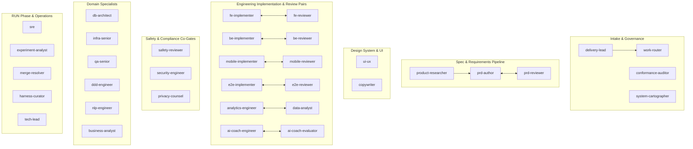
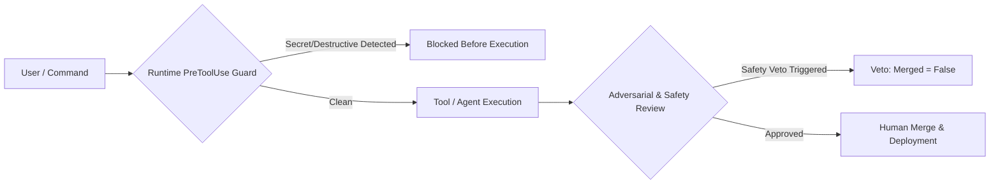

# Multi-Agent Build Harness Architecture

> [!abstract] TL;DR
> The **Multi-Agent Build Harness** is a portable, plugin-based operating system for AI coding assistants. It structures software delivery as a scaled-down engineering organization using **35 specialized AI agents** (implementer/reviewer pairs, safety veto gates, spec authors, SRE, and domain specialists). Driven by a core **five-command lifecycle** (`pickup → define → implement → ship → measure`), it enforces strict separation of builder vs. reviewer, non-bypassable safety vetoes, deterministic rule resolution, auto-tiered token cost controls, and runtime safety hooks—all fully customizable via a single project profile document.

---

## 1. Core Philosophy & Architectural Commitments

The Multi-Agent Build Harness operates on the premise that software delivery by AI agents must not rely on single monolithic prompts or unconstrained autonomy. Instead, it embeds the organizational rigor of high-performing engineering teams into the agent harness through three core commitments:

1. **No Agent Grades Its Own Homework**: Building and reviewing are strictly separated into independent agent roles. Reviewers are explicitly prompted to adopt an adversarial posture ("assume bugs exist; attempt to break the implementation") with a fresh context window.
2. **Humans Own Every Gate & Merge**: Agents act as proposal engines; human engineers retain decision authority. No agent merges code to main branches, flips production feature flags, or executes direct production schema mutations without human sign-off.
3. **Safety is a Non-Bypassable Veto Gate**: Any change touching a declared **safety surface** (e.g., user authentication, data privacy/PII, child safety, payments, shared core infrastructure) routes through dedicated safety reviewers equipped with an absolute, non-negotiable **veto power** (`merged: false`).

---

## 2. The 35-Agent Roster (Functional Groupings)

The harness organizes 35 specialized agent personas into functional clusters:



### Agent Roles Overview
* **Build Pairs**: Disciplined pairs (`fe`, `be`, `mobile`, `e2e`, `analytics-engineer`, `ai-engine`) executing builder-reviewer validation cycles.
* **Safety Co-Gates**: 
  * `safety-reviewer`: Product and operational safety veto.
  * `security-engineer`: AppSec vulnerability and exploit analysis.
  * `privacy-counsel`: Data Protection Officer (DPO) gate (lawful basis, data minimization, retention, child data).
* **Spec Pipeline**: `product-researcher` (user validation), `prd-author` (slice-based PRD authoring), `prd-reviewer` (adversarial spec validation).
* **Front Door & Governance**: `delivery-lead` (intake control tower scoring value × urgency ÷ effort), `work-router` (ticket sector/difficulty classifier), `conformance-auditor` (drift scanner), `system-cartographer` (traceability matrix generator).
* **Specialists**: `db-architect` (schema/migration design), `infra-senior` (IaC/deployment), `qa-senior` (test strategies), `ddd-engineer` (bounded context design), `nlp-engineer` (LLM/NLP metrics), `business-analyst` (requirements elicitation).
* **Operations & Lifecycle**: `sre` (incident detection, runbooks, postmortems), `experiment-analyst` (RAMP/HOLD/KILL decisions), `harness-curator` (learning synthesis via `/retro`).

---

## 3. The Five-Command Flow & Lifecycle

The software delivery lifecycle is driven by five primary developer commands, supported by specialized lifecycle commands:

```
[intake] ──> [research] ──> [design] ──> pickup ──> define ──> implement ──> ship ──> measure
                                                                               │
                                                                         [incident / RUN]
```

### 1. Front-Door & Upstream Phases
* **`intake`**: Triage external requests → deduplicate, score, classify via `work-router` and `delivery-lead` → present human-admitted backlog queue.
* **`research`**: User discovery before design/code → output `docs/research/<feature>.md` (jobs-to-be-done, user evidence, access needs). Can recommend a terminal "don't build" decision.
* **`design`**: UI/UX design generation → commit design HTML/Figma/prototypes → extract design tokens and page inventory.

### 2. Core Execution Phases
* **`pickup`**: Claim ticket with ownership locking + **competency claim-gate** verification. Checks upstream readiness gates (`requires_research`, `requires_design`, `requires_prd`).
* **`define`**: Create/adapt PRD via `prd-author` and `prd-reviewer`. Enforces **Rule 0 (Definition-of-Ready Checklist A–G)** and requires **dual sign-off**:
  * *AI Key*: `prd-reviewer` APPROVE (verifies correctness, completeness, safety surface).
  * *Human Key*: Requester / Product Lead sign-off (verifies intent).
* **`implement`**: Executes multi-lane build logic with auto-tiering (**DIRECT**, **LEAN**, **FULL**). Runs adversarial code review loops and mandatory safety gates.
* **`ship`**: Runs local quality gate verification (SonarQube mirror, type checks, lint, test suites, accessibility), opens pull/merge request (PR/MR) in feature-flagged/dark state. Requester close-out notification posted.
* **`measure`**: `experiment-analyst` evaluates live telemetry data against target metrics → outputs RAMP (scale up), HOLD (gather more data), KILL (rollback), or ITERATE recommendations.
* **`incident`**: RUN phase SRE operator → detect → mitigate → resolve → blameless postmortem → backlog remediation ticketing.

---

## 4. Auto-Tiering & Cost Control Architecture

To minimize AI token expenditure while preserving strict quality guarantees, the harness automatically selects execution strategies based on work type, scope, and diff size:

### Work-Type Lanes
Tickets are tagged with a work `lane`:
* `app-feature`: Full flag-ramped pipeline + E2E + experiment bundle.
* `internal-tool` / `integration`: Streamlined LEAN build without feature flags.
* `dashboard` / `data-pull`: Data discipline pipeline (`analytics-engineer` + data correctness checks).
* `bugfix`: Direct targeted fix pipeline.

### Execution Tiers (`implement`)
Within code lanes, `implement` evaluates code rules, safety surfaces, file count, and estimated line changes:

| Signal | Tier | Execution Strategy |
| :--- | :--- | :--- |
| No rules · No safety surface · ≤~2 files | **DIRECT** | Edit in main session directly; no subagent cold-start. |
| Rule-bearing or safety surface, single discipline OR small multi-discipline change (≤~80 lines / ≤~6 files) | **LEAN** *(Default)* | Build in main session + **one** isolated independent reviewer per discipline (+ safety reviewer if safety surface). |
| Multi-discipline **AND** large/risky change | **FULL** | Full paired-review fan-out orchestration, auto-preceded by a reviewed architecture plan doc. |

### Cost Optimization Levers
1. **Isolated Subagents for Review Only**: Builders run in-session; only reviewers and safety gates execute in cold-started subagents to guarantee fresh, unbiased judgment.
2. **Delta Re-Reviews**: Round 1 performs full diff analysis; Rounds 2+ review only changed lines.
3. **Model Tiering**:
   * **Opus**: High-judgment, safety, adversarial, and spec review roles.
   * **Sonnet**: Builder, implementer, and code authoring roles.
   * **Haiku**: Mechanical linting, formatting, and structural checks.
4. **`quality-max` Opt-In Preset**: Allows teams to explicitly force Opus and high-reasoning effort across all roles for critical work, overriding standard cost-saving defaults.

---

## 5. Project Tailoring & Rule Resolution System

The harness maintains complete decoupling between core engine logic and project specifics through a two-tiered configuration model:

```
                  ┌─────────────────────────────────────────┐
                  │      .claude/project-profile.md         │
                  │ (Machine Config: Stack, Safety Surfaces,│
                  │  Module Map, Tracking, Model Tiers)     │
                  └────────────────────┬────────────────────┘
                                       │
                                       ▼
┌───────────────────────────┐      ┌──────┐      ┌───────────────────────────┐
│ Templates / Agent Baseline│ ───> │  ⊕   │ <─── │     .claude/RULES.md      │
│      (AB-* Rules)         │      └──────┘      │  (Human Override Layer)   │
└───────────────────────────┘         │          └───────────────────────────┘
                                      ▼
                   ┌────────────────────────────────────┐
                   │ Resolved Project Rules & Guidance  │
                   └────────────────────────────────────┘
```

### 1. Single Source of Truth (`.claude/project-profile.md`)
Generated via `/harness:init`, this file declares project identity, tech stack, module boundaries, safety surfaces, tracking configuration, and Definition of Done. Agents import this preamble dynamically.

### 2. Deterministic Rule Resolution (`.claude/RULES.md`)
Project conventions are defined by combining harness baselines with project overrides:
* **Baselines**: Standard cross-cutting rules (`AB-NAME`, `AB-STRUCT`, `AB-IMPORT`, `AB-TYPE`, `AB-CONTRACT`, `AB-BOUNDARY`, `AB-SECRET`) and discipline prefixes (`FE-*`, `BE-*`, `DB-*`, `UIUX-*`).
* **Resolution Algorithm**:
  1. Load harness baseline.
  2. Match project rules in `RULES.md §1` by ID or topic.
  3. Replace matched baseline with project rule (project override wins).
  4. Apply **Safety Floor**: Overrides may only make safety, privacy, or security rules *stricter*, never weaker.
* **Non-Technical Binding Rules**:
  * `RULES.md §2 (Scope)`: Binds `work-router` and PRD reviews; out-of-scope work is rejected.
  * `RULES.md §3 (Approach)`: Binds implementation plan docs and PRD architecture stances.
  * `RULES.md §4 (Guardrails)`: Enforced strictly by code reviewers on diffs.

---

## 6. Two-Layer Safety & Security Enforcement

Security and safety are enforced at both review-time and execution-time:



### Layer 1: Review-Time Veto
Independent safety, security, and privacy reviewers inspect code diffs. If a safety surface violation occurs, the workflow returns `merged: false`. This decision cannot be overridden by deadlines or general code approval.

### Layer 2: Runtime Tool Guard Hooks
Deterministic Node-based hooks intercept agent tool calls prior to execution:
* **`guard-tool-call.js`**: Intercepts and blocks catastrophic operations (`rm -rf /`, `DROP DATABASE`, disk wipes, protected branch force-pushes, accessing `.env` or secret files).
* **`secret-scan.js`**: Scans tool inputs and prompt submissions for AWS, Anthropic, OpenAI, or API provider keys, blocking execution if a secret is exposed.
* **`compress-bash-output.js`**: Compresses oversized stdout outputs to prevent context window bloat.
* **`completion-gate.js`**: Prevents subagents from terminating early during autonomous multi-step `/deliver` runs.
* **`rtk-rewrite.js`**: Intercepts shell commands to route execution through token-optimized CLI proxies (`rtk`).

---

## 7. Design System Extraction & Verification

The harness connects design artifacts directly to code components through an extraction pipeline:

1. **Extraction Snapshot (`/harness:design tokens`)**: Parses committed design HTML exports, Figma assets, or prototype files into `design/extracted/<name>/`:
   * `pages.json`: Page/frame/state inventory.
   * `PAGES.md`: Human-readable page listing.
   * `tokens.json`: Canonical semantic design tokens (colors, typography, spacing).
   * `screens/*.png`: Visual snapshots for screenshot verification.
2. **Digest (`DESIGN.md`)**: Generated human-readable digest updated automatically from extracted tokens.
3. **Automated Verification Skills**:
   * **`design-system-check`**: Validates code diffs against `pages.json` and extracted HTML structures.
   * **`design-token-check`**: Reconciles CSS/Tailwind/React Native theme tokens against `tokens.json`, flagging `DRIFT`, `MISSING`, or `EXTRA` tokens during `/ship`.

---

## 8. Advanced Mechanics & Quality Verification

### Cross-Model Council (`/council`)
To eliminate single-model blind spots during high-risk architectural or safety decisions:
* **Mechanism**: Claude acts as Council Chair; an alternative model lineage (e.g., Codex) attempts to refute the proposed design/review.
* **Proof Gate (`council-proof`)**: Measures decorrelated catches (valid bugs caught by the secondary model that Claude missed) versus false-positive noise. Shape B scaling is gated until Shape A demonstrates a net quality improvement.

### System Mapping (`/map`) & Conformance Auditing (`/audit`)
* **`system-cartographer` (`/map`)**: Analyzes foreign keys, API endpoints, and UI state handlers to generate a live **FE-BE-DB Traceability Matrix**.
* **`conformance-auditor` (`/audit`)**: Scans live codebases against `.claude/project-profile.md` to identify missing CODEOWNERS, un-gated safety surfaces, or missing rule test cases, minting remediation tickets.

### Harness Validator (`test/validate.js`)
A zero-dependency Node validation script run via `npm test` and pre-push hooks to prevent harness drift. It enforces 15+ internal structural invariants:
* Agent count matches README.
* Command and workflow references resolve.
* Frontmatter schema correctness across all 35 agents and 24 commands.
* Marketplace and plugin version synchronization.

---

## 9. Key Architectural Takeaways

1. **Role-Based Scaled Engineering**: Operates software delivery like a structured engineering organization rather than an unguided LLM chat session.
2. **Adaptive Autonomy**: Auto-tiers rigor from lightweight DIRECT edits up to FULL paired reviews based on empirical risk and diff size signals.
3. **Safety & Spec Supremacy**: Enforces Rule 0 (spec completeness) and non-bypassable safety vetoes to ensure high quality before code reaches main branches.
4. **Context & Cost Efficiency**: Employs delta re-reviews, output compression, model tiering, and lazy context loading to achieve 60-90% savings on development operations.

---

## 10. Code Implementations

### Cross-Model Refutation Bridge (`hooks/codex-bridge.js`)

```javascript
#!/usr/bin/env node
'use strict';
// multi-agent-harness — cross-model council bridge.
// Dispatches refutation prompts to a secondary model lineage (Codex) to catch correlated errors.

const { spawnSync } = require('child_process');
const fs = require('fs');
const path = require('path');

function runCodexRefutation(prompt, diffPath) {
  try {
    const res = spawnSync('codex', ['exec', '--prompt', prompt], { encoding: 'utf8', timeout: 30000 });
    if (res.error || res.status !== 0) return { status: 'skipped', reason: 'Codex CLI unavailable or timed out' };
    return { status: 'success', output: res.stdout };
  } catch (e) {
    return { status: 'skipped', reason: e.message };
  }
}
```

### Cross-Model Council Proof Harness (`hooks/council-proof.js`)

```javascript
#!/usr/bin/env node
'use strict';
// multi-agent-harness — council proof harness (Shape A → Shape B staging gate).
// Evaluates decorrelated catches vs false-positive noise from docs/adr/council-ledger.jsonl.

const fs = require('fs');
const path = require('path');

function evaluateLedger(ledgerPath) {
  if (!fs.existsSync(ledgerPath)) return { verdict: 'PENDING', reason: 'No ledger file exists yet' };
  const lines = fs.readFileSync(ledgerPath, 'utf8').split('\n').filter(Boolean);
  let catches = 0, noise = 0;
  for (const l of lines) {
    try {
      const rec = JSON.parse(l);
      if (rec.decorrelated_catch) catches++;
      if (rec.noise_rejected) noise++;
    } catch (_e) {}
  }
  if (catches >= 3 && noise / Math.max(1, catches) < 0.5) return { verdict: 'PASS', catches, noise };
  return { verdict: 'PENDING', catches, noise };
}
```

---

## Related Notes

- [[Multi-Agent Harness Organizational Model]]
- [[Multi-Agent Harness Command Lifecycle]]
- [[Two-Layer Guarding and Non-Bypassable Veto Architecture]]
- [[Auto-Tiering and Token Cost Discipline Architecture]]
- [[Project Tailoring and Deterministic Rules Architecture]]


