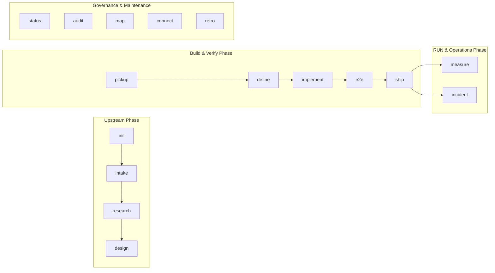

# Multi-Agent Harness Command Lifecycle

> [!abstract] TL;DR
> The **Multi-Agent Harness Command Lifecycle** structures the entire software delivery process around a five-command core flow (`pickup → define → implement → ship → measure`), supported by specialized upstream, operational, and governance commands (`intake`, `research`, `design`, `e2e`, `incident`, `status`, `audit`, `map`, `connect`, `retro`). Each command is **self-right-sizing**—automatically selecting its execution depth, isolated subagents, and gate requirements from work-lane signals, diff sizes, and safety surfaces without manual developer configuration.

---

## 1. The Core 5-Command Lifecycle (The Developer Ritual)

The primary developer workflow is organized into five core commands operating across seven distinct beats (Beats A through G):

```
       Beat A: Load         Beats B + PRD: Spec         Beat C: Build        Beats D+E: Gate & Ship    Beat G: Measure & Decide
      ┌──────────────┐      ┌──────────────────┐      ┌──────────────┐      ┌────────────────────┐    ┌────────────────────────┐
      │   pickup     │ ───> │     define       │ ───> │  implement   │ ───> │       ship         │ ──>│        measure         │
      │  (Orient &   │      │  (Author PRD &   │      │ (Build Loop  │      │ (Local Verification│    │ (Analyze Experiment &  │
      │  Claim Ticket│      │   DoR Sign-off)  │      │ & Paired Rev)│      │  & Open MR Dark)   │    │  Recommend Next Move)  │
      └──────────────┘      └──────────────────┘      └──────────────┘      └────────────────────┘    └────────────────────────┘
```

---

## 2. In-Depth Breakdown of the Core 5 Commands

### Beat A: `pickup` (Load & Orient)
* **Purpose**: Claims ownership of a ticket, verifies competency eligibility, loads PRD and design assets, and presents a dense orientation briefing to the developer before planning begins.
* **Key Mechanisms**:
  1. **Atomic Ownership Lock**: Uses a compare-and-set Git reference lock (`claim.js`) or tracker assignment to prevent double-claiming across parallel developer sessions.
  2. **Competency Gate Check**: Resolves the claimer's role tiers against the ticket's `sectors` and `difficulty`. Enforces stretch-with-pairing for single-tier gaps or redirects specialists to single-sector child tickets.
  3. **Upstream Readiness Check (§4c)**: Hard-blocks if required upstream artifacts (`requires_research`, `requires_design`, `requires_prd`) are missing.
* **Outputs**: Seed plan and locked ticket status (`picked` / `in-progress`). Read-only on codebase.

### Spec Stage: `define` (Requirements & Rule 0 Sign-Off)
* **Purpose**: Transforms raw ticket skeletons or external product briefs into a pitch-shaped, slice-based PRD (`docs/prd/<feature>.md`).
* **Key Mechanisms**:
  1. **Interactive Gap Resolution**: Asks open questions with proposed `(Recommended)` answers to streamline stakeholder alignment.
  2. **Adversarial Spec Review (`prd-reviewer`)**: Runs the **Definition-of-Ready Checklist A–G** (Traceable, Well-formed, Complete, Safe, Unambiguous, Scope-honest, Signed-off).
  3. **Dual-Key Sign-off Recording**:
     * *AI Key*: `prd-reviewer` APPROVE (technical correctness & safety surface re-derivation).
     * *Human Key*: Product Lead / Requester sign-off (product intent).
* **Outputs**: `docs/prd/<feature>.md` with `prd_ready: DoR✓ · ai:APPROVE · human:<signed>`.

### Beat C: `implement` (Paired-Review Build Loop)
* **Purpose**: Orchestrates the build and adversarial code review loop to construct the feature behind a feature flag.
* **Key Mechanisms**:
  1. **Auto-Tiering Engine**:
     * **DIRECT**: Single discipline, $\le 2$ files, no rules/safety → in-session edit.
     * **LEAN** *(Default)*: In-session build + 1 isolated subagent reviewer per discipline (+ safety reviewer if safety surface).
     * **FULL**: Multi-discipline and large/risky diffs → paired-review fan-out orchestration preceded by a reviewed plan doc.
  2. **Adversarial Peer Review**: Isolated subagent reviewer attempts to disprove the diff. Round 1 conducts a full review; Rounds 2+ perform delta re-reviews.
  3. **Non-Bypassable Veto Gate**: If the diff touches a declared safety surface, `safety-reviewer` (and `privacy-counsel` on PII/data surfaces) must issue a clear sign-off.
* **Outputs**: Tested feature branch with green QA verification, ready for pre-push shipping.

### Beats D + E: `ship` (Pre-Push Quality Gate & Dark Ship)
* **Purpose**: Single, non-bypassable pre-push verification bundle that commits code, opens the merge request (MR/PR), and updates ticket tracking.
* **Key Mechanisms**:
  1. **Verification Bundle (Lane-Aware)**:
     * `spec-rule-check`: Proves tests exist for every declared Product Rule ID.
     * `rule-check`: Verifies code conventions against `.claude/RULES.md`.
     * `design-system-check` & `design-token-check`: Enforces UI layout and token fidelity against extracted snapshots (`pages.json`/`tokens.json`).
     * `security-review` & `safety-reviewer` Sign-off: Mandatory check for §5 safety surfaces.
     * Local CI Mirror & SonarQube Quality Gate Mirror: Pre-push coverage and smell checks.
  2. **Dark Shipping**: Opens MR/PR with feature flags set to 0% exposure.
  3. **Requester Close-Out Comment**: Posts release details to the intake requester card for non-experiment lanes.
* **Outputs**: Open MR/PR ready for human review and merge.

### Beat G: `measure` (Experiment Loop Closure)
* **Purpose**: Reads live telemetry and experiment data for feature-flagged rollouts, recommending next operational moves.
* **Key Mechanisms**:
  1. **`experiment-analyst` Execution**: Evaluates primary metrics, guardrail metrics, and audience segment performance against declared PRD criteria.
  2. **Ramp / Hold / Kill / Iterate Decision**:
     * **RAMP**: Scale exposure up to next percentage step.
     * **HOLD**: Maintain current exposure to gather more statistical power.
     * **KILL**: Rollback feature flag immediately (mandatory on guardrail regression).
     * **ITERATE**: Route back to `product-researcher` or implementer for refinements.
  3. **Experiment Graduation (§24)**: Promotes winning experiment scope into `NORTH-STAR.md` and retires the feature flag upon human confirmation.
* **Outputs**: Decision memo at `docs/experiments/<flag>.md`. Read-only on production flags; human executes the flag toggle.

---

## 3. Extended Lifecycle & System Commands

In addition to the 5-command core, the harness provides specialized commands covering the full software delivery lifecycle:



### Upstream Discovery Commands
* **`init`**: Bootstraps the harness for a new or live repository. Interviews the team, auto-detects stack/modules, creates `.claude/project-profile.md`, and configures team rosters and repo topology.
* **`intake`**: Front-door request management. Triage incoming requests, scores value vs. effort via `delivery-lead`, and presents human-admitted tickets.
* **`research`**: Conducts upstream UX and user problem discovery before design or coding starts. Emits findings doc `docs/research/<feature>.md`.
* **`design`**: Generates UI/UX design assets, HTML prototypes, or design playbooks. Extracts design tokens into `design/extracted/<name>/`.
* **`add`**: Mints individual ad-hoc backlog tickets post-initialization.

### Execution & Verification Commands
* **`e2e`**: Executes journey-level end-to-end integration tests using Playwright across critical user flows.
* **`done`**: Finalizes ticket state post-merge, releases locks, updates roadmap boards, and unblocks dependent tickets.
* **`deliver`**: Lane-aware autopilot mode. Runs the entire pipeline (`research → design → define → implement → ship`) with configurable pauses (`auto`, `checkpoint`, `manual`).

### Operations & Maintenance Commands
* **`incident`**: RUN-phase SRE driver. Detects production incidents, guides mitigation, conducts blameless postmortems, and files backlog fix tickets.
* **`status` / `checkpoint`**: Read-only orientation pass. Summarizes project health, in-flight tickets, working tree state, and next action line.
* **`audit`**: Conformance scanner. Audits live code against `.claude/project-profile.md` for un-gated safety surfaces or missing CODEOWNERS.
* **`map`**: Generates live DB↔BE↔FE connectivity diagrams and the FE-BE-DB Traceability Matrix (`docs/system/`).
* **`connect`**: Interactive MCP connection wizard. Configures `.mcp.json` and manages provider tokens.
* **`retro`**: Self-improvement sweep. Runs `harness-curator` to consolidate recurring learnings and propose harness enhancements.

---

## 4. Auto-Right-Sizing Matrix Across Commands

The harness intelligence automatically adjusts execution behavior across commands based on work-lane classification:

| Work Lane | `pickup` / `define` Requirement | `implement` Strategy | `ship` Verification Bundle | `measure` / Close-Out |
| :--- | :--- | :--- | :--- | :--- |
| **`app-feature`** | Full PRD + Dual Sign-off + Design Snapshot | Auto-tiered (LEAN/FULL), Paired Review, Safety Veto | Rule coverage, Safety Sign-off, Design Token Check, Local CI | `measure` Experiment Analysis (Statsig) |
| **`internal-tool`** | Light PRD / Draft REQ allowed | LEAN Build (No Feature Flag) | Rule coverage, Local CI, Security check (if auth/data) | Direct close-out comment to requester |
| **`integration`** | Seam contract defined | LEAN Build + Idempotency Test | Rule coverage, Idempotency proof, Local CI | Direct close-out comment to requester |
| **`dashboard` / `data-pull`** | Query & metric spec | `analytics-engineer` + Data correctness review | `data`-correctness proof, Privacy sign-off (no PII leak) | Close-out comment on intake card |
| **`bugfix`** | Regression scope definition | Direct / LEAN target fix | Regression test coverage, Local CI | Ticket status transition |

---

## 5. Code Implementations

### Atomic Git-Ref Ticket Claim Lock (`hooks/claim.js`)

```javascript
#!/usr/bin/env node
'use strict'
// multi-agent-harness — atomic, low-latency ticket claim.
// Uses detached commits pushed to `refs/harness/claims/<ticket>` as a server-side Compare-And-Set lock.

const { execFileSync } = require('child_process')

const REMOTE = (process.argv[2] === 'reap' ? null : process.argv[4]) || process.env.HARNESS_CLAIM_REMOTE || 'origin'
const TIMEOUT = Number(process.env.HARNESS_CLAIM_TIMEOUT_MS) || 8000
const REF = (t) => `refs/harness/claims/${t}`

function git(args, opts) {
  return execFileSync('git', args, { encoding: 'utf8', timeout: TIMEOUT, stdio: ['pipe', 'pipe', 'pipe'], ...opts }).trim()
}
function degrade(why) { process.stdout.write(`DEGRADE ${why}\n`); process.exit(2) }

if (process.env.HARNESS_CLAIM_DISABLE === '1') degrade('disabled')

let me = ''
try { me = git(['config', 'user.email']) } catch {}
if (!me) degrade('no-git-identity')
try { git(['rev-parse', '--is-inside-work-tree']) } catch { degrade('not-a-git-repo') }
try { git(['remote', 'get-url', REMOTE]) } catch { degrade(`no-remote:${REMOTE}`) }

const cmd = process.argv[2]
const ticket = process.argv[3]
if (['acquire', 'owner', 'release'].includes(cmd) && !ticket) degrade('no-ticket')

function readOwner(t) {
  let ls = ''
  try { ls = git(['ls-remote', REMOTE, REF(t)]) } catch { degrade('ls-remote-failed') }
  if (!ls) return null
  try {
    git(['fetch', '--depth=1', '--no-tags', REMOTE, REF(t)])
    const msg = git(['log', '-1', '--format=%B', 'FETCH_HEAD'])
    const m = msg.match(/"owner"\s*:\s*"([^"]+)"/)
    return m ? m[1] : 'unknown'
  } catch { return 'unknown' }
}

try {
  if (cmd === 'owner') {
    const o = readOwner(ticket)
    if (!o) { process.stdout.write('FREE\n'); process.exit(1) }
    process.stdout.write(`OWNER ${o}\n`); process.exit(0)
  }

  if (cmd === 'release') {
    const o = readOwner(ticket)
    if (o && o !== me) { process.stdout.write(`NOTOWNER ${o}\n`); process.exit(1) }
    try { git(['push', REMOTE, `:${REF(ticket)}`]) } catch {}
    process.stdout.write('RELEASED\n'); process.exit(0)
  }

  if (cmd === 'acquire') {
    const emptyTree = git(['mktree'], { input: '' })
    const payload = JSON.stringify({ ticket, owner: me, ts: new Date().toISOString(), nonce: `${process.pid}-${Date.now()}-${Math.random().toString(36).slice(2)}` })
    const commit = git(['commit-tree', emptyTree, '-m', payload])
    try {
      git(['push', REMOTE, `${commit}:${REF(ticket)}`])
      process.stdout.write(`ACQUIRED ${me}\n`); process.exit(0)
    } catch (e) {
      const o = readOwner(ticket)
      if (o && o !== me) { process.stdout.write(`HELD ${o}\n`); process.exit(1) }
      if (o === me) { process.stdout.write(`RESUMED ${me}\n`); process.exit(0) }
      degrade('push-failed')
    }
  }
} catch (e) {
  degrade('unexpected')
}
```

---

## Related Notes

- [Multi-Agent Build Harness Architecture](Multi-Agent%20Build%20Harness%20Architecture.md)
- [Multi-Agent Harness Organizational Model](Multi-Agent%20Harness%20Organizational%20Model.md)
- [Two-Layer Guarding and Non-Bypassable Veto Architecture](Two-Layer%20Guarding%20and%20Non-Bypassable%20Veto%20Architecture.md)
- [Auto-Tiering and Token Cost Discipline Architecture](Auto-Tiering%20and%20Token%20Cost%20Discipline%20Architecture.md)
- [Project Tailoring and Deterministic Rules Architecture](Project%20Tailoring%20and%20Deterministic%20Rules%20Architecture.md)


