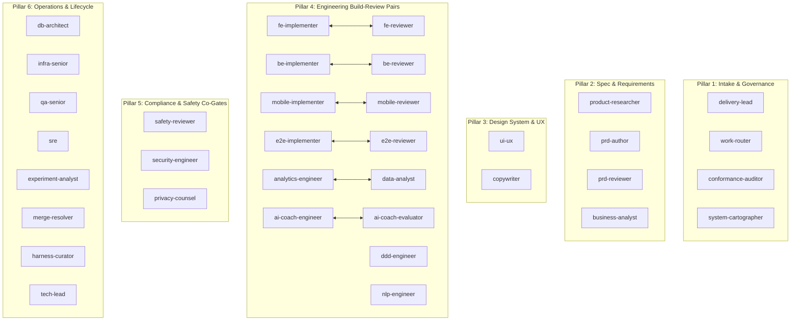

# Multi-Agent Harness Organizational Model

> [!abstract] TL;DR
> The **Multi-Agent Harness Organizational Model** structures AI-assisted software delivery as a scaled-down engineering organization. Using **35 specialized AI agent personas** alongside human operators, it enforces absolute separation between builder and reviewer, non-bypassable safety vetoes, dual-key PRD sign-off, objective competency claim-gates, and contract-first ticket sequencing.

---

## 1. Core Organizational Philosophy & Separation of Powers

The harness operates on three foundational governance principles:

```
┌───────────────────────────┐      ┌───────────────────────────┐      ┌───────────────────────────┐
│     BUILDER AGENT         │      │     REVIEWER AGENT        │      │    HUMAN ENGINEER/LEAD    │
│  (Proposes Implementation) │ ───> │  (Adversarial Refutation) │ ───> │ (Final Decision & Merge)  │
└───────────────────────────┘      └───────────────────────────┘      └───────────────────────────┘
```

1. **No Agent Grades Its Own Homework**: Building and reviewing are strictly assigned to separate context windows. Reviewer agents adopt an adversarial posture ("assume bugs exist; attempt to break the code").
2. **Strict Separation of Powers**:
   * **Proposal Authority**: Builder agents propose code diffs and architectural plans.
   * **Advisory/Refutation Authority**: Reviewer agents identify defects, lint violations, and spec mismatches.
   * **Veto Authority**: Safety, Security, and Privacy gatekeepers hold absolute veto power (`merged: false`).
   * **Decision & Merge Authority**: Humans retain sole authority over code merges, production flag flipping, and PRD intent sign-off.
3. **Multi-Role Operating System**: Different human roles (Product Lead, UX Researcher, UI Designer, Developer, QA Engineer, SRE) operate specific lifecycle commands, backed by specialized AI agents.

---

## 2. Complete Agent Roster & Functional Clusters

The 35 specialized agents are divided into 6 distinct organizational pillars:



### Specialist Subagents (Depth Within Sectors)
Specialists provide deep domain expertise within existing sectors when dispatched by the orchestrator:
* `ddd-engineer` (`be` sector): Bounded context boundaries, aggregates, and domain invariants.
* `nlp-engineer` (`ai` sector): Intent/entity extraction, retrieval evaluation, and language model metrics.
* `business-analyst` (`research` sector): Stakeholder elicitation → testable requirements.
* `data-analyst` (`data` sector): Metric definition and statistical analysis alongside `analytics-engineer`.

---

## 3. Authority Matrix & Decision-Making Topology

| Role / Persona | Proposes | Reviews / Inspects | Veto Authority | Final Sign-off | Can Merge? |
| :--- | :---: | :---: | :---: | :---: | :---: |
| **Implementer Agents** (`fe`, `be`, `mobile`, `e2e`) | Code Diffs | ❌ | ❌ | ❌ | ❌ |
| **Reviewer Agents** (`fe-reviewer`, `be-reviewer`) | Remediation | Code & Tests | ❌ (Flags Blockers) | ❌ | ❌ |
| **`safety-reviewer`** | Policy Fixes | Safety Surface | **YES (Absolute)** | ❌ | ❌ |
| **`security-engineer`** | AppSec Fixes | Exploits / Vulns | **YES (Security)** | ❌ | ❌ |
| **`privacy-counsel`** | Privacy Fixes | PII / DPO Rules | **YES (Legal/Privacy)** | ❌ | ❌ |
| **`prd-reviewer`** | Spec Tweaks | PRD Completeness | **YES (DoR Gate)** | **AI Key (Correctness)** | ❌ |
| **Requester / Product Lead** | Feature Briefs | PRD Intent | ❌ | **Human Key (Intent)** | ❌ |
| **Human Developer / Lead** | Overrides | Full Pull Request | ❌ | **Final DoD Approval** | **YES** |

### The Dual-Key Sign-off Mechanism (Rule 0)
For any feature to move from `define` to `implement`, the PRD must receive **two independent keys**:
1. **AI Key (`prd-reviewer` APPROVE)**: Certifies *technical correctness*, completeness, traceability (Requirements A–G), and safety surface identification.
2. **Human Key (Requester Sign-off)**: Certifies *product intent* ("Is this what we actually want to build?").

---

## 4. Competency Model & Claim-Gate Governance

Defined in `templates/competency-model.md`, the claim-gate ensures tickets are assigned strictly based on verified skill levels and team capacity.

### 1. Sector & Tier Matrix
* **10 Sectors**: `fe`, `be`, `db`, `mobile`, `qa`, `uiux`, `research`, `infra`, `ai`, `data`.
* **3 Tier Levels**: `junior < mid < senior`.
* Developer profiles explicitly list sector tiers (e.g., `fe:senior be:mid db:none`).

### 2. Difficulty Rubric (Signal-Based Classification)
`work-router` classifies ticket difficulty objectively:
* `safety_surface: yes` → **Floor to `senior`** (no junior claims permitted).
* Spans $\ge 3$ sectors → **Bump up 1 tier** (cross-discipline coordination overhead).
* Cross-module contract change or $\ge 3$ Product Rules → **Bump up 1 tier**.
* DB migrations, IaC, or novel patterns → **Bump up 1 tier**.
* Mechanical/scaffold CRUD → **Stays `junior`**.

### 3. Claim Eligibility & Stretch-with-Pairing
* **Eligible**: Developer tier $\ge$ ticket difficulty in *all* required sectors.
* **Stretch**: Short by exactly 1 tier in 1 sector. Allowed **only with explicit pairing**: a `senior` in that sector is pinned as the required Pull Request reviewer (`requires_pairing`).
* **Blocked**: Short by $>1$ tier or rated `none` in any required sector.

### 4. Parent / Child Ticket Claim-Split Architecture
To support both **fullstack engineers** and **discipline specialists**, multi-sector tickets are automatically split:

```
[PARENT TICKET] (Whole Feature Package — e.g. FE + BE + DB)
  ├── PRD & Dual Sign-off (Shared by all children)
  ├── CHILD 1: <PARENT>-db  (Sector: db)   ──> Sequenced First
  ├── CHILD 2: <PARENT>-be  (Sector: be)   ──> Depends on DB (Seam defined)
  └── CHILD 3: <PARENT>-fe  (Sector: fe)   ──> Depends on BE (API Contract defined)
```

* **Fullstack Path**: A polymath engineer eligible across all sectors claims the **Parent** directly.
* **Specialist Path**: Specialist engineers claim individual **Child** tickets. The parent auto-completes when all children are shipped.
* **Contract-First Sequencing**: Hard dependency chain (`db → be → fe / mobile`). Upstream API/DB contracts must be published or merged before view-layer children can be picked up.

---

## 5. Adversarial Builder ⇄ Reviewer Pairing Mechanics

```
┌──────────────────────────────────────────────────────────┐
│                 MAIN SESSION WORKSPACE                   │
│                                                          │
│  1. Implementer Builds Code & Unit Tests                │
│  2. Local Rules & Lint Checked                           │
└────────────────────────────┬─────────────────────────────┘
                             │
                             ▼ Code Diff & Spec Handoff
┌──────────────────────────────────────────────────────────┐
│             ISOLATED SUBAGENT WORKSPACE                  │
│                                                          │
│  1. Reviewer Persona Cold-Starts                         │
│  2. Adversarial Inspection ("Find defects & rule breaks")│
│  3. Round 1: Full Review | Round 2+: Delta Re-Review    │
└────────────────────────────┬─────────────────────────────┘
                             │
                ┌────────────┴────────────┐
                ▼                         ▼
         [Blockers Found]         [Clean / Approved]
                │                         │
                └─> Loop to Fix           └─> Pass to Safety Veto
```

* **Cost-Efficient Isolation**: Builders run in the main session; reviewers execute in cold-started subagents to preserve cognitive independence while saving 60-90% on token overhead.
* **Delta Re-Reviews**: Round 1 conducts a complete audit. Rounds 2+ re-audit *only modified lines*, avoiding redundant context spending.

---

## 6. Continuous Governance & Feedback Loops

1. **Intake Governance Loop**: `delivery-lead` triages external requests using a transparent scoring formula ($\text{Value} \times \text{Urgency} \div \text{Effort}$) to present a ranked backlog proposal for human admission.
2. **Code-to-Spec Conformance Audit**: `conformance-auditor` (`/audit`) scans live codebases against `.claude/project-profile.md` to identify drift, un-gated safety surfaces, or missing tests.
3. **Production Incident RUN Loop**: `sre` (`/incident`) manages production failures (Detect → Mitigate → Postmortem), converting postmortem action items into backlog remediation tickets.
4. **Adaptive Self-Improvement Loop**: `harness-curator` (`/retro`) extracts recurring project learnings, consolidating patterns that recur $\ge 3$ times into candidate rule updates for human review.

---

## 7. Code Implementations

### Paired Adversarial Review Workflow (`workflows/paired-review.example.js`)

```javascript
// Claude Code Workflow: paired adversarial review loop for one feature.
// Shape: implement -> adversarial peer review (loop until clean) -> safety gate (if §5) -> QA rule-tests -> DoD verdict.

export const meta = {
  name: 'multi-agent-harness-paired-review',
  description: 'Implement a feature, run adversarial FE/BE peer review until clean, gate on safety + QA.',
  phases: [
    { title: 'Test-first (red)' },
    { title: 'Implement' },
    { title: 'Peer review' },
    { title: 'Copy' },
    { title: 'Safety gate' },
    { title: 'QA' },
    { title: 'Verdict' },
  ],
}

const a = typeof args === 'string' ? JSON.parse(args) : args
const {
  discipline, task, ruleIds = [], touchesSafetySurface = false,
  touchesPII = false,
  agentPrefix = 'multi-agent-harness:',
  mode = 'full',
  rounds = mode === 'light' ? 1 : 2,
  reviewEffort = 'high',
  runCopy = true,
  files = [],
  acceptance = '',
  testFirst = false,
} = a

const PAIRS = {
  fe: ['fe-implementer', 'fe-reviewer'],
  be: ['be-implementer', 'be-reviewer'],
  mobile: ['mobile-implementer', 'mobile-reviewer'],
  infra: ['infra-senior', 'infra-senior'],
  ai: ['ai-coach-engineer', 'ai-coach-evaluator'],
  data: ['analytics-engineer', 'analytics-engineer'],
}
if (!PAIRS[discipline]) {
  throw new Error(`paired-review: discipline must be 'fe' | 'be' | 'mobile' | 'infra' | 'ai' | 'data'`)
}
const [implName, revName] = PAIRS[discipline]
const implementer = agentPrefix + implName
const reviewer = agentPrefix + revName

const REVIEW_SCHEMA = {
  type: 'object',
  required: ['verdict', 'findings'],
  properties: {
    verdict: { type: 'string', enum: ['APPROVE', 'BLOCK'] },
    findings: {
      type: 'array',
      items: {
        type: 'object',
        required: ['location', 'severity', 'problem', 'fix'],
        properties: {
          location: { type: 'string' },
          severity: { type: 'string', enum: ['critical', 'high', 'medium', 'low'] },
          problem: { type: 'string' },
          fix: { type: 'string' },
        },
      },
    },
  },
}
```

### E2E Journey Review Workflow (`workflows/e2e-review.example.js`)

```javascript
// Claude Code Workflow: adversarial E2E authoring loop for one feature.
// Shape: qa-senior scopes journeys -> e2e-implementer authors -> e2e-reviewer adversarial review -> safety gate -> verdict.

export const meta = {
  name: 'multi-agent-harness-e2e-review',
  description: 'Scope, author, and adversarially review the Playwright E2E journey layer for a feature.',
  phases: [
    { title: 'Scope' },
    { title: 'Author' },
    { title: 'E2E review' },
    { title: 'Safety gate' },
    { title: 'Verdict' },
  ],
}

const a = typeof args === 'string' ? JSON.parse(args) : args
const {
  feature,
  app = 'web',
  reqIds = [],
  ruleIds = [],
  touchesSafetySurface = false,
  agentPrefix = 'multi-agent-harness:',
  mode = 'full',
  rounds = mode === 'light' ? 1 : 2,
  reviewEffort = mode === 'light' ? 'medium' : 'high',
  files = [],
} = a
```

---

## Related Notes

- [[Multi-Agent Build Harness Architecture]]
- [[Multi-Agent Harness Command Lifecycle]]
- [[Two-Layer Guarding and Non-Bypassable Veto Architecture]]
- [[Auto-Tiering and Token Cost Discipline Architecture]]
- [[Project Tailoring and Deterministic Rules Architecture]]


