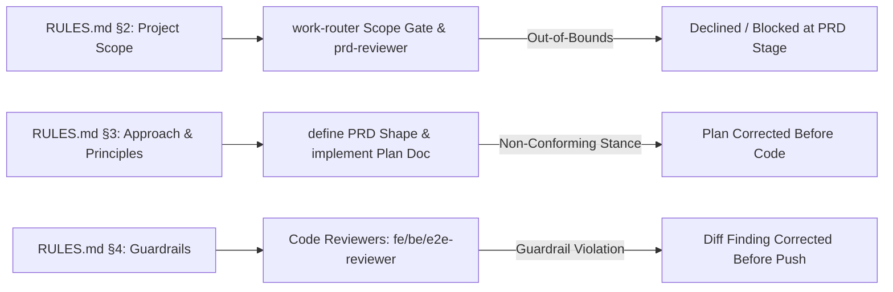

# Project Tailoring and Deterministic Rules Architecture

> [!abstract] TL;DR
> The **Project Tailoring and Deterministic Rules Architecture** achieves complete decoupling between portable multi-agent engine machinery and project-specific configuration. Through a single machine-readable profile (`.claude/project-profile.md`) and a human rulebook (`.claude/RULES.md`), any project can customize agent behavior, coding conventions, safety surfaces, and architecture stances. Rules are resolved via a **deterministic 5-step procedure** ($\text{Resolved} = \text{Baseline} \oplus \text{RULES.md}$) that guarantees consistent behavior across all 35 agents without editing prompt files, while enforcing an inviolable safety floor.

---

## 1. Architectural Separation & Decoupling

In traditional agentic setups, tailoring prompts to a specific stack or coding standard requires editing dozens of agent system prompts. This creates extreme maintenance drift whenever the harness updates.

The harness solves this by splitting configuration into three distinct layers:

```
┌────────────────────────────────────────────────────────────────────────────────────────┐
│                   1. PORTABLE HARNESS BASELINES (Plugin-Provided)                      │
│   • Cross-cutting baselines (AB-NAME, AB-IMPORT, AB-SECRET, AB-WRITE...)                   │
│   • Discipline-specific craft rules (FE-*, BE-*, DB-*, UIUX-*, COPY-*, QA-*)              │
└──────────────────────────────────────────┬─────────────────────────────────────────────┘
                                           │
                                           ▼
┌────────────────────────────────────────────────────────────────────────────────────────┐
│                   2. HUMAN RULEBOOK (Project Overrides: .claude/RULES.md)               │
│   • §1 Code Conventions · §2 Scope · §3 Approach & Principles · §4 Guardrails          │
└──────────────────────────┬──────────────────────────────┬──────────────────────────────┘
                           │                              │
                           ▼                              ▼
┌──────────────────────────────────────────┐  ┌──────────────────────────────────────────┐
│      DETERMINISTIC RESOLUTION ENGINE     │  │  3. MACHINE PROFILE (.claude/project-    │
│  Resolved = Baseline ⊕ RULES.md          │  │     profile.md)                          │
│  (Override Wins, Safety Floor Enforced)  │  │  • Tech Stack, Module Map, Safety        │
└──────────────────────────┬───────────────┘  │    Surfaces, DoD, Model Tiers             │
                           │                  └────────────────────┬─────────────────────┘
                           │                                       │
                           └───────────────────┬───────────────────┘
                                               ▼
                                 ┌───────────────────────────┐
                                 │ RESOLVED AGENT INSTRUCTIONS│
                                 └───────────────────────────┘
```

---

## 2. Single Source of Machine Truth (`.claude/project-profile.md`)

The project profile is generated during harness initialization (`/harness:init`) by interviewing the team or scanning an existing repository. 

### Preamble Dynamic Injection
The root `CLAUDE.md` `@import`s `.claude/project-profile.md`. Every spawned agent dynamically inherits the project's exact profile values in its preamble without hardcoding project specifics into agent files.

### Key Profile Sections
* **§1 Identity & Framing**: Project mission, target audience, and domain boundaries.
* **§2 Stack & Topology**: Frameworks, database engines, deployment targets, and repository topology (single-app, monorepo, polyrepo).
* **§3 Module Map & Protected Paths**: Internal module boundaries, CODEOWNERS, and protected core paths (auth, payments, shared schemas).
* **§4 Product Rules**: Numbered Product Rule IDs (`RULE-1`, `RULE-2`) referenced in acceptance criteria and unit test names.
* **§5 Safety Surfaces**: Declared high-risk paths requiring mandatory `safety-reviewer`, `security-engineer`, or `privacy-counsel` veto gates.
* **§6 Design System Bar & Voice**: Canonical design tokens, typography, accessibility bar (WCAG AA), and brand voice guidelines.
* **§8 Definition of Done**: Project-wide DoD checklist (flag-ramped, test coverage thresholds, telemetry, accessibility).
* **§9 Model Tiers**: Per-role model allocations (Opus, Sonnet, Haiku) and opt-in `quality-max` flags.
* **§10 Quality Gate Mirrors**: Local CI/SonarQube mirror thresholds.
* **§11 Tracking Mode**: Backend issue tracker mapping (LOCAL, GitLab, GitHub, ClickUp).

### Adoption Modes (Greenfield vs. Existing Codebase)
`/harness:init` detects codebase maturity:
* **Greenfield**: Generates a phased build roadmap and empty backlog.
* **Existing Codebase**: Reverse-engineers stack, modules, rules, and safety surfaces into the profile. **Grandfathering Rule**: Existing code is grandfathered; new or touched code is gated forward on the diff. The `/audit` command scans gaps between live code and the declared profile to mint remediation tickets.

---

## 3. The Deterministic Rule Resolution Engine

Agents do not read raw prompt files alone; they execute code and reviews against **resolved rule sets**.

### The 5-Step Resolution Procedure (`RL3`)

```
1. BASELINE   = AB-* (cross-cutting) + discipline rules ([FE-*] / [BE-*] / ...)
2. OVERRIDES  = Read .claude/RULES.md (§1 – §4)
3. MATCH & RESOLVE (for each rule R in OVERRIDES):
      a. Match by ID (explicit: e.g. AB-NAME, FE-4) ──> REPLACE baseline rule with R
      b. Match by Topic (implicit: e.g. "import paths use @/...") ──> REPLACE baseline
      c. No Match (additive: scope/approach/guardrail) ──> ADD R as new rule
4. SAFETY FLOOR:
      For any safety (§5), privacy, or security rule:
      Resolved = STRICTER of {Baseline, R}
      (Weakening overrides are rejected automatically)
5. PROFILE SUBSTITUTION:
      Substitute concrete project names, paths, and rule IDs from project-profile.md
```

### Single-Rule Override Guarantee
A project overrides or adds a convention by stating **only that specific rule** in `.claude/RULES.md`. All unmentioned rules remain at their baseline defaults. Because matching and precedence are fixed:
* **Zero Agent Edits**: No agent system prompt is edited to change a convention.
* **Deterministic Identical Resolution**: Two independent agents or readers resolve the exact same single-rule override identically.

---

## 4. Binding Non-Technical Rules (§2–§4 in `RULES.md`)

While `RULES.md §1` covers technical code conventions (overriding `AB-*` baselines), sections §2–§4 have no agent baseline and **bind directly at workflow gates**:



* **§2 Project Scope**: Out-of-bounds requests are flagged `scope: out-of-bounds` by `work-router` and declined at intake or blocked during PRD authoring.
* **§3 Approach & Principles**: Architecture stances, build order, and testing posture bind PRD creation and `/implement` planning docs.
* **§4 Guardrails**: Additive "always/never" rules are enforced directly on diffs by code reviewers as hard findings.

---

## 5. Labelled Baselines Index (`AB-*`)

Cross-cutting baselines live in `templates/agent-baselines.md` and are shared by all build/review agents:

| Baseline ID | Rule Description | Override Category (`RULES.md`) |
| :--- | :--- | :---: |
| **`AB-NAME`** | Components `PascalCase`, functions/vars `camelCase`, files `kebab-case`, booleans predicate (`isLapsed`). | §1 (Code Conventions) |
| **`AB-STRUCT`** | One feature/bounded-context per folder; colocate unit tests + styles; vertical slices over layer-folders. | §1 (Code Conventions) |
| **`AB-IMPORT`** | Absolute imports from root alias (`@/...`); no deep `../../../` relative chains; enforce boundary isolation. | §1 (Code Conventions) |
| **`AB-TYPE`** | No `any` in committed code; explicit return types on exports; types inferred from contracts (`z.infer`). | §1 (Code Conventions) |
| **`AB-COMMENT`** | Comment the *why*, not the *what*; no committed commented-out code. | §1 (Code Conventions) |
| **`AB-CONTRACT`** | Request/response DTOs inferred from shared contract; consumers parse (`zod.parse`), never blind-cast. | §3 (Approach) |
| **`AB-FLAG`** | User-facing changes ship dark behind feature flags; never default-on; human flips production. | §3 (Approach) |
| **`AB-BOUNDARY`** | Business logic in domain/backend modules, never view layer; cross-boundary access via contract only. | §4 (Guardrails) |
| **`AB-OBS`** | Structured telemetry via logging package, never `console.log`; **no PII in logs**. | §4 (Guardrails) |
| **`AB-SECRET`** | No secrets in code/logs; read from environment/store. Inviolable (safety floor). | §4 (Guardrails) |
| **`AB-WRITE`** | User-facing copy reads like a senior human wrote it: natural rhythm, specific over generic, **no AI em-dashes (—)**. | §6 Profile $\rightarrow$ §1 |

---

## 6. Mechanical Rule Verification & Conformance Auditing

To ensure resolved rules and profiles remain enforced over time, the harness provides two mechanical verification tools:

### 1. `rule-check` Skill (`skills/rule-check`)
Lints code diffs against the **resolved** technical rules (`AB-*` baseline $\oplus$ `RULES.md §1`). Runs during Beat D (`/ship`) to verify that any custom project convention is strictly respected before pushing.

### 2. `conformance-auditor` (`/audit`)
Scans live codebases against `.claude/project-profile.md` to identify structural drift:
* Modules missing assigned `CODEOWNERS`.
* Safety surfaces lacking assigned veto gates.
* Product Rules lacking corresponding unit test suites.
* Permissive PII access scopes.
Outputs evidence-backed remediation tickets that enter the standard delivery flow.

---

## 7. Code Implementations

### Plugin Hooks Manifest (`hooks/hooks.json`)

```json
{
  "description": "multi-agent-harness hooks configuration",
  "hooks": {
    "PostToolUse": [
      {
        "description": "Compress oversized Bash stdout before entering context",
        "handler": {
          "type": "command",
          "command": "node \"${CLAUDE_PLUGIN_ROOT}/hooks/compress-bash-output.js\""
        }
      },
      {
        "description": "Print live Mermaid live diagram editor links after docs writes",
        "handler": {
          "type": "command",
          "command": "node \"${CLAUDE_PLUGIN_ROOT}/hooks/mermaid-live-link.js\""
        }
      }
    ],
    "PreToolUse": [
      {
        "description": "Block secret file access and catastrophic commands",
        "handler": {
          "type": "command",
          "command": "node \"${CLAUDE_PLUGIN_ROOT}/hooks/guard-tool-call.js\""
        }
      },
      {
        "description": "Scan tool inputs for credential/token content",
        "handler": {
          "type": "command",
          "command": "node \"${CLAUDE_PLUGIN_ROOT}/hooks/secret-scan.js\""
        }
      },
      {
        "description": "Rewrite Bash commands through RTK token-optimized CLI proxy",
        "handler": {
          "type": "command",
          "command": "node \"${CLAUDE_PLUGIN_ROOT}/hooks/rtk-rewrite.js\""
        }
      }
    ],
    "UserPromptSubmit": [
      {
        "description": "Scan prompt text for credential/token content",
        "handler": {
          "type": "command",
          "command": "node \"${CLAUDE_PLUGIN_ROOT}/hooks/secret-scan.js\""
        }
      }
    ],
    "Stop": [
      {
        "description": "Block premature stop while autonomous run is in flight",
        "handler": {
          "type": "command",
          "command": "node \"${CLAUDE_PLUGIN_ROOT}/hooks/completion-gate.js\""
        }
      }
    ],
    "SessionStart": [
      {
        "description": "Check installed plugin version against latest marketplace",
        "handler": {
          "type": "command",
          "command": "node \"${CLAUDE_PLUGIN_ROOT}/hooks/check-plugin-update.js\""
        }
      }
    ]
  }
}
```

### Zero-Dependency Structural Config Validator (`test/validate.js`)

```javascript
#!/usr/bin/env node
'use strict';
// multi-agent-harness config validator — zero-dependency structural checks for the plugin.
// Enforces JSON syntax, markdown frontmatter, model tier validity, command references, and version sync.

const fs = require('fs');
const path = require('path');
const cp = require('child_process');

const ROOT = path.resolve(__dirname, '..');
const VALID_MODELS = ['opus', 'sonnet', 'haiku', 'inherit'];

const failures = [];
function fail(check, msg) { failures.push(`[${check}] ${msg}`); }

function checkJson() {
  const jsons = ['.claude-plugin/plugin.json', '.claude-plugin/marketplace.json', 'hooks/hooks.json'].filter(f => fs.existsSync(path.join(ROOT, f)));
  for (const rel of jsons) {
    try { JSON.parse(fs.readFileSync(path.join(ROOT, rel), 'utf8')); }
    catch (e) { fail('json', `${rel} is not valid JSON: ${e.message}`); }
  }
}
```

---

## Related Notes

- [Multi-Agent Build Harness Architecture](Multi-Agent%20Build%20Harness%20Architecture.md)
- [Multi-Agent Harness Organizational Model](Multi-Agent%20Harness%20Organizational%20Model.md)
- [Multi-Agent Harness Command Lifecycle](Multi-Agent%20Harness%20Command%20Lifecycle.md)
- [Two-Layer Guarding and Non-Bypassable Veto Architecture](Two-Layer%20Guarding%20and%20Non-Bypassable%20Veto%20Architecture.md)
- [Auto-Tiering and Token Cost Discipline Architecture](Auto-Tiering%20and%20Token%20Cost%20Discipline%20Architecture.md)

