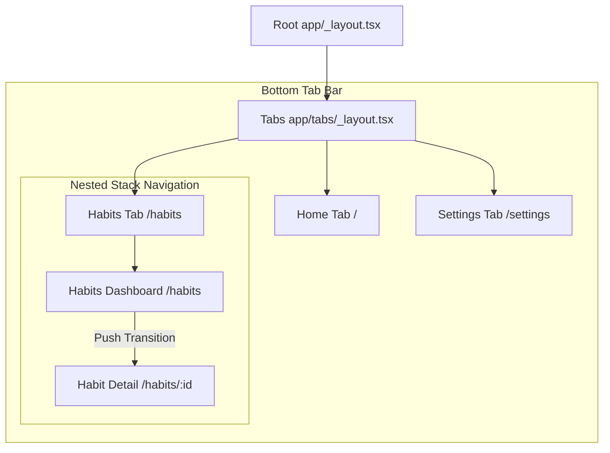

# 2.3 Dynamic Routing and Params

> [!abstract] TL;DR
> Dynamic routing maps variable segments in your URL paths (e.g. `[id]`) to parameters in React Native screens. Expo Router matches dynamic segments automatically and exposes them, along with query parameters, using the `useLocalSearchParams` hook. Type-safety for route parameters is handled out-of-the-box by Expo's generated TypeScript definitions.

## Digest

In mobile applications, screens often display content fetched dynamically based on an identifier (e.g., viewing a specific habit, user profile, or chat room). Expo Router matches these routes using brackets, mirroring web-based routing libraries.

### Dynamic Route Configurations

Dynamic segments are declared by wrapping a filename or directory in square brackets:

- **`app/habit/[id].tsx`** maps to paths like `/habit/exercise` or `/habit/123`, where `id` is the dynamic parameter.
- **`app/habit/[id]/_layout.tsx`** allows you to nest a layout (like tabs or another stack) specifically for that dynamic item context.
- **`app/habit/[...rest].tsx`** is a catch-all route that matches any depth (e.g., `/habit/123/logs/settings`), passing an array of segments as the parameter.

### Passing Parameters

Parameters can be passed as path variables or query parameters:

```tsx
import { Link, router } from 'expo-router';

// 1. Declaratively via pathname and params object
<Link
  href={{
    pathname: '/habit/[id]',
    params: { id: 'meditation-3', category: 'Mindfulness', streak: 5 }
  }}
>
  View Meditation
</Link>

// 2. Imperatively via router object
const navigateToHabit = (habitId: string) => {
  router.push({
    pathname: '/habit/[id]',
    params: { id: habitId, category: 'Health' }
  });
};
```

When compiled:
- The path variable `id` is inserted into the URL template: `/habit/meditation-3`.
- Any extra keys in `params` not matching a route segment are automatically appended as query parameters: `/habit/meditation-3?category=Mindfulness&streak=5`.

### Reading Parameters: Local vs. Global Search Params

Expo Router provides two hooks to read route and query parameters:

1. **`useLocalSearchParams` (Recommended)**: Returns the parameters scoped specifically to the current screen. When screen transitions occur, this hook only triggers a re-render for the active screen, avoiding unnecessary renders on background screens.
2. **`useGlobalSearchParams`**: Returns parameters globally across all active screens in the entire navigation stack. Useful in rare cases where parent headers or tabs need to react instantly to a deeply nested screen's parameters.

Here is how you read parameters inside a screen:

```tsx
// app/habit/[id].tsx
import { View, Text, StyleSheet } from 'react-native';
import { useLocalSearchParams } from 'expo-router';

export default function HabitDetailScreen() {
  // Extract both path variables and query parameters
  const { id, category, streak } = useLocalSearchParams();

  return (
    <View style={styles.container}>
      <Text style={styles.title}>Habit ID: {id}</Text>
      {category && <Text style={styles.subtitle}>Category: {category}</Text>}
      {streak && <Text style={styles.subtitle}>Current Streak: {streak} days</Text>}
    </View>
  );
}

const styles = StyleSheet.create({
  container: {
    flex: 1,
    padding: 16,
    backgroundColor: '#ffffff',
  },
  title: {
    fontSize: 24,
    fontWeight: 'bold',
  },
  subtitle: {
    fontSize: 16,
    color: '#666666',
    marginTop: 8,
  },
});
```

### Type-Safe Parameters

Expo Router auto-generates types for your dynamic paths, but parameter types (like query parameters) are typed as string or array of strings. To enforce strict type-safety, we can define a TypeScript schema for our parameters:

```tsx
// types/routes.ts
export type HabitDetailParams = {
  id: string;
  category?: 'Mindfulness' | 'Health' | 'Fitness';
  streak?: string; // Query params are always received as strings or string arrays
};

// app/habit/[id].tsx
import { useLocalSearchParams } from 'expo-router';
import { HabitDetailParams } from '../../types/routes';

export default function HabitDetailScreen() {
  // Cast search params to your strict type interface
  const { id, category, streak } = useLocalSearchParams<HabitDetailParams>();
  
  // TypeScript now autocomplete and type-checks category
  return (
    <View>
      <Text>ID: {id}</Text>
    </View>
  );
}
```

## Drill

Modify the detail screen to read dynamic parameters passed from a dashboard view and display them with type-safe properties.

### Task Description
1. Create a list screen featuring several mock items with different IDs, names, and statistics.
2. Configure a dynamic route segment (`app/habit/[id].tsx`) that serves as the detail screen.
3. Configure the list screen to navigate to the dynamic detail screen when an item is selected, passing:
   - The item ID in the path (`/habit/[id]`).
   - Query parameters containing additional details (e.g., custom name, active state, completion count).
4. In the detail screen, use `useLocalSearchParams` to extract the path variables and query parameters.
5. Create a TypeScript type definition for your parameter hook to ensure parameter properties are typed and auto-completed.
6. Display the extracted parameters clearly on the detail screen layout.

> [!example] Success criteria
> - [ ] Selecting different list items loads the same detail view code but displays the correct dynamic ID in the URL/screen.
> - [ ] Parameter extraction is handled strictly with `useLocalSearchParams`.
> - [ ] TypeScript compilation fails if you attempt to access an undeclared search parameter on the hook return value.
> - [ ] Query parameters are successfully parsed and rendered alongside the dynamic path parameter.

---

## 🏗️ Capstone Milestone: UI Shell

You have learned how to manage stacks, construct tab layouts, and link screens dynamically using Expo Router. It is time to assemble these pieces into a complete, clean, and interactive **UI Shell** for the Habit Tracker application.

### Objective

Construct the foundational layout structure of the Habit Tracker, featuring bottom tabs for main dashboards, nested navigation stacks, and dynamic transitions to detailed views. This layout will serve as the host for the database and viewmodel logic in subsequent modules.

### Feature Layout and Folder Anatomy

Your task is to organize your `app/` folder to host three main tabs and a nested habit details view. 

```
app/
├── (tabs)/
│   ├── _layout.tsx           # Instantiates Bottom Tab Navigator
│   ├── index.tsx             # Home screen (Today's check-off checklist)
│   ├── habits/               # Habits Management tab (Folder containing nested stack)
│   │   ├── _layout.tsx       # Instantiates Stack Navigator for Habit-specific screens
│   │   ├── index.tsx         # Habits Dashboard (List of all habits + "Add" button)
│   │   └── [id].tsx          # Habit Detail / Stats screen (Dynamic route)
│   └── settings.tsx          # Settings screen (App preferences)
└── _layout.tsx               # Root layout (handles global theme providers)
```

### Navigation Flows and Transitions

Your shell must support the following navigation paths and visual behavior:



1. **Root Layout (`app/_layout.tsx`)**:
   - Acts as the entry point. It should load fonts or setup global context providers (e.g. for theme or styling) and immediately render the inner navigator (in this case, the `(tabs)` group).

2. **Tabs Layout (`app/(tabs)/_layout.tsx`)**:
   - Renders the bottom tab bar.
   - Shows three tabs: **Home**, **Habits**, and **Settings**.
   - Customizes tab icons based on whether the tab is currently focused.
   - Hides the Tab-level header for the `habits` tab to hand over control to the nested stack.

3. **Habits Stack Layout (`app/(tabs)/habits/_layout.tsx`)**:
   - Defines a nested navigation stack.
   - The primary screen is `index.tsx` (Habits List).
   - Dynamically pushes `[id].tsx` (Habit Details) onto the stack.
   - Animates screen transitions (e.g., slide-over from right on iOS, fade-in on Android).

4. **Habits List Screen (`app/(tabs)/habits/index.tsx`)**:
   - Renders a list of mock habits (e.g., "Drink Water", "Read Book", "Gym").
   - Pressing a habit row initiates navigation using `router.push()` or `<Link href={{ pathname: '/habits/[id]', params: { id } }}>`.

5. **Habit Detail Screen (`app/(tabs)/habits/[id].tsx`)**:
   - Extracts the dynamic `id` parameter from the URL using `useLocalSearchParams`.
   - Modifies the navigation header title dynamically (e.g., showing the name of the habit in the top header).
   - Renders a back button in the header that pops the screen and returns the user to the Habits list, maintaining tab state.

### Type-Safe Verification

To verify that your routing structure is fully typed under Expo Router v3:
- Verify that your paths are analyzed by checking the auto-generated file `.expo/types/expo-router.d.ts`.
- Ensure TypeScript compile checks (`npx tsc`) pass without any explicit casting (`any`) in your routing calls.

## Related
- Prev: [[2.2 Tabs and Nested Navigators]]
- Next: [[3.1 Architecture and Hooks Pattern]]
- See also: [[learn-react-native]]
