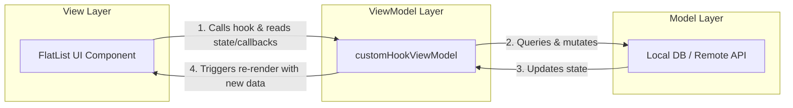

# 3.1 Architecture and Hooks Pattern

> [!abstract] TL;DR
> Modern React Native applications decouple visual layout from business logic using the **Model-View-ViewModel (MVVM)** pattern, implemented via **Custom Hooks**. By separating state management, side effects, and platform-specific behaviors into custom hooks (ViewModels), UI components become stateless, highly testable presentation layers (Views).

## Digest

In React's early days, developers separated concerns using the **Container-Presenter** pattern. High-level "container" components fetched data and managed state, then passed down props to stateless "presenter" components. While functional, this pattern led to deeply nested JSX wrapper trees, complex prop drilling, and boilerplate class code.

With the introduction of Hooks, the community transitioned to a **Custom Hooks as ViewModels** pattern. This approach is highly effective in React Native, where UI components need to remain lightweight and platform-agnostic, while business logic must handle complex states like network requests, local database interaction, and platform-specific APIs.

### Container-Presenter vs. Hooks-as-ViewModels (MVVM)

| Dimension | Container-Presenter Pattern | Custom Hooks as ViewModels (MVVM) |
| :--- | :--- | :--- |
| **Structure** | Visual components wrapped inside a logical component wrapper. | Pure function hook called directly inside a presentation component. |
| **JSX Tree** | Adds extra nodes to the component hierarchy, cluttering React DevTools. | Flat component hierarchy; hooks are evaluated inside the component's render loop. |
| **Logic Reuse** | Reusing logic requires Higher-Order Components (HOCs) or render props. | Hooks can be composed, nested, and reused across any component. |
| **Testing** | Requires mocking components or mounting wrapper containers. | Custom hooks can be tested in isolation using `@testing-library/react-hooks`. |

In the MVVM context:
- **Model**: The domain data structures (e.g., API responses, local database schemas).
- **View**: The stateless React Native components rendering layout, colors, and typography (using `<View>`, `<Text>`, `<FlatList>`).
- **ViewModel**: The custom hook encapsulating state, side-effects, and actions, exposing a clean API to the View.



### Decoupling Logic, State, and Platform Behaviors

Separating logic from presentation makes React Native components more robust:

1. **Platform-Specific Behaviors**: React Native apps often require different logic for iOS and Android. Wrapping this logic inside a custom hook prevents platform checks (`Platform.OS === 'ios'`) from cluttering your styling and visual layout.
2. **Device State Integration**: Logic related to AppState changes (foreground/background transitions), net status, or keyboard events should live in the hook.
3. **Stateless Presentation**: By removing state (`useState`, `useEffect`) from UI components, the UI becomes a predictable mapping of `state -> UI`. These stateless components are easy to design in storybooks and test with snapshots.

### Anatomy of a ViewModel Hook

A well-designed custom hook acts as a boundary. It returns a structured object consisting of:
- **Read-only state**: Structured data properties required by the UI (e.g., `habits`, `isLoading`, `error`).
- **Triggers and Callbacks**: Stable functions that the UI invokes to perform actions (e.g., `addHabit`, `toggleHabit`).

#### Hook Lifecycle and Component Mount/Unmount

Custom hooks are not standalone background threads; they run inside the React component's execution context:
- When a component mounts, the hook is invoked. Its inner hooks (like `useState` and `useEffect`) initialize.
- A `useEffect` inside a custom hook triggers its setup callback upon mounting.
- Returning a cleanup function from `useEffect` ensures that when the parent component unmounts, background listeners (e.g., WebSocket connections, device event listeners) are properly torn down, preventing memory leaks.

```tsx
// Concept Example: Designing a stateless view boundary
// Visual Presentation Layer (View)
import React from 'react';
import { View, Text, Button, ActivityIndicator } from 'react-native';

interface ItemListViewProps {
  // Read-only state
  items: string[];
  isLoading: boolean;
  // Triggers/Callbacks
  onAddItem: () => void;
}

export function ItemListView({ items, isLoading, onAddItem }: ItemListViewProps) {
  if (isLoading) {
    return <ActivityIndicator size="large" />;
  }

  return (
    <View style={{ padding: 16 }}>
      {items.map((item, index) => (
        <Text key={index}>{item}</Text>
      ))}
      <Button title="Add Item" onPress={onAddItem} />
    </View>
  );
}
```

## Drill

Implement a clean MVVM structure for a habit tracking dashboard. You will separate visual rendering from list state, adding habits, and filtering by category.

### Task Description

1. Define a custom hook `useHabitViewModel` that manages:
   - A list of habits. Each habit should have an `id`, `name`, and `category` (e.g., 'Health', 'Mindfulness', 'Work').
   - A category filter state (e.g., filter to 'Health' or show 'All').
   - Handlers for adding a new habit and toggling the filter.
2. The hook should return a read-only state representation (e.g., filtered habits list, current filter) and state mutators (e.g., `addHabit`, `setCategoryFilter`).
3. Write a stateless `<HabitList>` component that consumes `useHabitViewModel`.
4. The component must map the returned data using native layout components (`<FlatList>`, `<Text>`, `<TextInput>`, etc.) and trigger updates through the hook's callbacks.

> [!example] Success criteria
> - [ ] The visual component does not contain any state variables (`useState` or `useEffect`).
> - [ ] All data, filter states, loading states, and update handlers come exclusively from `useHabitViewModel`.
> - [ ] Separation of concerns is clear and structured: visual presentation contains layout and styles, while the hook contains all business logic.

## Related

- Prev: [[2.3 Dynamic Routing and Params]]
- Next: [[3.2 Server State with TanStack Query]]
- See also: [[learn-react-native]]
