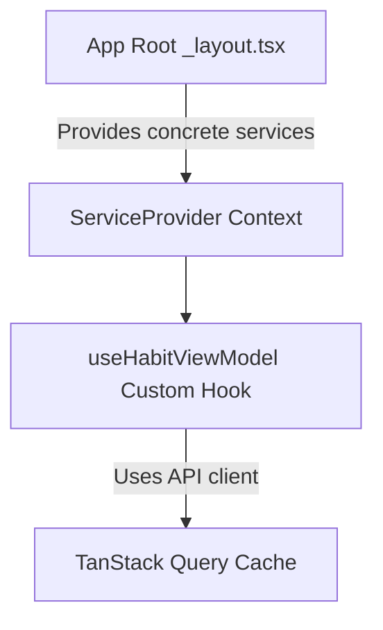

# 3.3 Dependency Injection via React Context

> [!abstract] TL;DR
> Dependency Injection (DI) decoupled from concrete classes makes React Native apps modular and testable. By utilizing React Context as a dependency injector, custom hooks (ViewModels) can request abstract services (like API clients or databases) from their environment rather than importing them directly, allowing easy service swapping for testing or platform-specific adaptations.

## Digest

In software engineering, **Dependency Injection (DI)** is a pattern where an object's dependencies are provided to it rather than created by the object itself. 

In standard React development, hooks and components often import concrete instances of services directly:

```tsx
// Tight Coupling: Hard to test, hard to swap
import { habitApi } from '../../services/HabitApi';

export function useHabits() {
  return useQuery({
    queryKey: ['habits'],
    queryFn: () => habitApi.fetchList() // Directly coupled to standard network client
  });
}
```

This direct import causes several architectural issues:
1. **Brittle Unit Testing**: To test `useHabits` in isolation, you must use complex module mocking tools (e.g., `jest.mock`) to hijack the import statement.
2. **Platform and Storage Coupling**: If you decide to swap your networking client from a REST API to a local SQLite database, you have to modify every custom hook that references the API directly.

### React Context as a DI Container

We can solve this by using React Context as a lightweight **Service Locator** or **DI Provider**. 

Rather than import concrete services, the application defines a React Context at its root that holds the service instances. Custom hooks consume these services from the React context.



### Benefits of Context-Based DI

1. **Clean Test Mocking**: During unit tests, you wrap the hook under test in a custom React Context Provider that supplies mock implementations of your services.
2. **Modular Architecture**: Visual layers (Views) and logic layers (ViewModels) are completely separated from data storage and communication details (Services).
3. **Decoupled Environment Configuration**: You can inject mock services during development (for offline previewing in simulator layouts) and swap in real HTTP client services in production without editing a single hook or screen.

### Implementing React Context DI

The pattern consists of three steps:

#### 1. Define the Service Interface and Context

We define the interface of the service and create the React Context container:

```tsx
// Concept Example: Setting up a service context
import React, { createContext, useContext } from 'react';

// Define the interface contract
export interface ILoggerService {
  log: (message: string) => void;
}

// Create the Context container
const ServiceContext = createContext<{ loggerService: ILoggerService } | null>(null);
```

#### 2. Provide the Concrete Implementation

At the entry point of your app (e.g., the root `_layout.tsx`), instantiate the services and feed them into the context provider:

```tsx
// Root component
const concreteLogger: ILoggerService = {
  log: (msg) => console.log(`[AppLog] ${msg}`),
};

export default function RootLayout() {
  return (
    <ServiceContext.Provider value={{ loggerService: concreteLogger }}>
      {/* Visual application tree */}
    </ServiceContext.Provider>
  );
}
```

#### 3. Consume in Custom Hooks

Create a custom hook helper to extract the service, and invoke it inside your business logic hooks:

```tsx
export function useServices() {
  const services = useContext(ServiceContext);
  if (!services) {
    throw new Error('useServices must be used within a ServiceProvider');
  }
  return services;
}

// Consuming in a ViewModel custom hook
export function useLogViewModel() {
  const { loggerService } = useServices();

  const handleAction = () => {
    loggerService.log('Action performed');
  };

  return { handleAction };
}
```

## Drill

Set up dependency injection via React Context to inject data services into your custom hooks.

### Task Description

1. Define a `ServiceContext` and a `ServiceProvider` component that provides a mock habits data service.
2. Create an abstract interface or structure for the backend service (e.g., exposing a `fetchHabits` function and a `createHabit` function).
3. Create a concrete class or object implementing this interface that simulates remote server communication with simulated delays.
4. Refactor the `useHabitViewModel` custom hook to extract the habits service using `useContext` (via a helper `useServices` hook) instead of importing any concrete API class or functions directly.
5. Ensure `useQuery` and `useMutation` inside `useHabitViewModel` run their query and mutation functions by calling methods on the injected context service.

> [!example] Success criteria
> - [ ] A React Context and Provider are defined to hold the services.
> - [ ] The custom hook does not import or instantiate concrete network classes/functions directly.
> - [ ] The custom hook accesses services exclusively via the injected context, ensuring it is fully decoupled for test mocking.

---

## 🏗️ Capstone step: Reactive ViewModels + DI + Fake Networking

At this stage, you will wire up the state and data pipeline for the Habit Tracker application. You will connect the bottom-tab UI shell built in Phase 2 to a backend logic layer backed by TanStack Query, driving state via clean custom hooks injected with services through React Context.

### Habit Tracker Architecture Map

Below is the dependency map for the habit tracker:

```mermaid
graph TD
    subgraph UI Presentation Layer (Views)
        Dashboard[app/tabs/habits/index.tsx]
        Details[app/tabs/habits/[id].tsx]
    end

    subgraph Business Logic Layer (ViewModels)
        useHabitVM[useHabitViewModel]
    end

    subgraph Service Injection Layer (React Context DI)
        ServiceProvider[ServiceProvider]
        useServicesHook[useServices]
    end

    subgraph Data & Networking Layer
        QueryCache[TanStack Query Cache]
        MockHabitService[MockHabitService Implementation]
    end

    %% Wiring
    Dashboard -->|Reads data & callbacks| useHabitVM
    Details -->|Reads data & callbacks| useHabitVM
    useHabitVM -->|Requests service dependency| useServicesHook
    useServicesHook -->|Resolves service instance| ServiceProvider
    useHabitVM -->|Queries & mutates cache| QueryCache
    QueryCache -->|Performs remote fetch/mutation| MockHabitService
```

### Capstone Implementation Checklist

To complete this capstone milestone, implement the following architectural structure in your habit tracker codebase:

1. **Define the Service Layer Contract**:
   - Create a service interface that specifies CRUD operations for habits (e.g., retrieving habit lists, creating new habits, toggling completion status).
   - Implement a mock implementation of this service that stores habits in memory and returns Promises with artifical network delays (e.g., 800ms) to simulate real-world API behaviors.

2. **Establish the DI Context**:
   - Create a React Context container that holds instances of your services.
   - Wrap the root node of the application Stack/Tabs layout with this Service Provider.

3. **Build the Custom ViewModel Hooks**:
   - Build custom hooks (like `useHabitViewModel`) that retrieve the service from the DI context.
   - Use TanStack Query's `useQuery` and `useMutation` hooks inside the custom hook to fetch and update habit data, configuring caching behavior via the service functions.
   - Return clean state boundaries from the hooks (e.g., status booleans, item lists, category tags) and action trigger callbacks (e.g., `handleAddHabit`, `handleToggleHabit`).

4. **Refactor the UI Screens**:
   - Refactor the dashboard and detail screens to remove any locally-managed data state.
   - Bind all elements (like input fields, toggle check-boxes, list items, and buttons) to the state and callbacks returned by the custom ViewModel hooks.
   - Render loading indicators (spinners or skeleton loaders) and error cards depending on the status returned by the hooks.

## Related

- Prev: [[3.2 Server State with TanStack Query]]
- Next: [[4.1 High-Performance Key-Value Storage]]
- See also: [[learn-react-native]]
