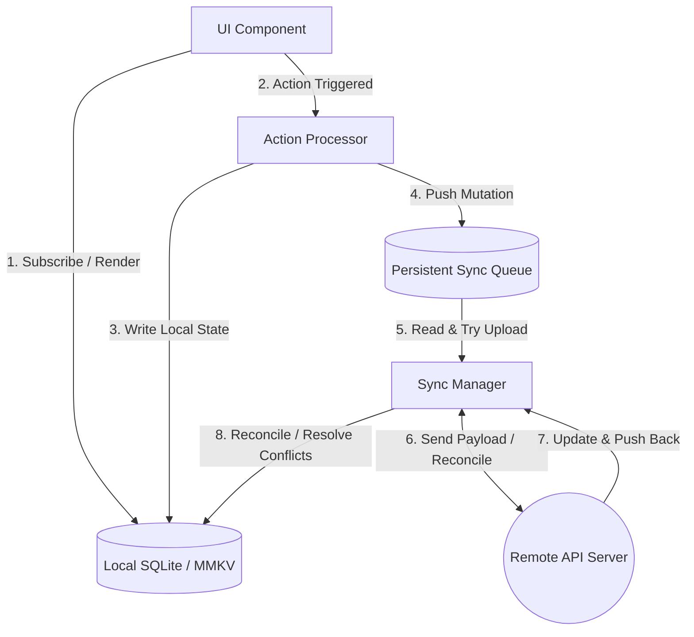
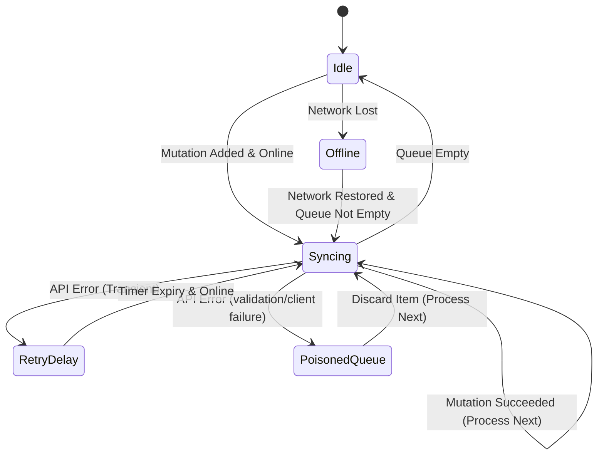

# 4.3 Offline-First Architecture

> [!abstract] TL;DR
> An offline-first mobile architecture treats local storage (SQLite and MMKV) as the single source of truth for the UI. Instead of sending actions directly over the network, mutations are persisted locally and queued. A sync worker processes this persistent queue sequentially in the background whenever network connectivity is restored, providing a latency-free user experience.

## Digest

In web development, applications often block the user interface with loading spinners while waiting for API responses. On mobile, users expect apps to work seamlessly regardless of network connectivity (e.g., in subways or elevators). 

An **Offline-First Architecture** ensures that the application remains fully interactive offline by decoupling user actions from network state.

---

### Single Source of Truth (SSOT) Pattern

In an offline-first architecture, UI components **never** query the backend API directly, and they never wait for backend confirmations to update their visual state. Instead:

1. **Read Path**: The UI subscribes to the local database. All data rendering is driven from local SQLite or MMKV data.
2. **Write Path**: User actions modify the local database immediately (providing instant, zero-latency feedback).
3. **Queue Path**: Simultaneously, the modification details are packed into a mutation task and stored in a persistent local queue.
4. **Sync Path**: A background coordinator synchronizes the queue with the backend server whenever a connection is active.



---

### Sync Queue Mechanics

A reliable offline queue must persist across application restarts. If a user marks three habits as completed while offline and closes the app, those changes must remain queued for execution during the next session.

#### Mutation Representation
Each item in the queue represents a delta or operation, typically containing:
- `id`: A unique UUID for the queue item.
- `action`: The action name (e.g., `'HABIT_CREATE'`, `'HABIT_TOGGLE'`).
- `payload`: The input variables required to run the operation (JSON object).
- `timestamp`: When the user performed the action (crucial for conflict resolution).
- `retryCount`: To identify and isolate failing or poisoned messages (preventing infinite loops).

---

### Synchronization State Machine

The Sync Manager executes operations sequentially (FIFO - First In, First Out) to preserve the causality of events. The sync flow behaves like a state machine:



1. **Idle**: The queue is empty.
2. **Offline**: The device is disconnected. Mutations accumulate in the queue but no sync is attempted.
3. **Syncing**: The worker pops the oldest mutation, serializes it, and sends it to the server.
4. **RetryDelay**: A transient network failure occurred (e.g., timeout). The manager backs off, waits, and retries.
5. **Poisoned / Permanent Fail**: The server rejects the mutation (e.g., 400 Bad Request, validation fail). The item is logged and discarded (or sent to a dead-letter queue) to avoid blocking subsequent mutations.

---

### Optimistic UI Updates and Conflict Resolution

When local state changes ahead of the server, the client must reconcile differences when syncing.

#### Conflict Strategies

1. **Last-Write-Wins (LWW)**:
   Every record includes an `updatedAt` timestamp. When syncing, if the database record on the server is newer than the client's mutation timestamp, the server rejects the client's write. If the client's mutation timestamp is newer, the server applies the change.
2. **Client-Wins / Server-Wins**:
   Simple override logic. In habit tracking, client-wins is typical for toggles, as the client device represents the user's primary intent.
3. **Operational Merge**:
   Applying incremental modifications (e.g., increasing a completion count integer) instead of replacing the entire object.

---

## Drill

Design a robust offline synchronization queue that saves pending mutations locally when offline, listens to network connectivity changes, and syncs pending mutations sequentially when online.

### Task Description

1. Define a TypeScript interface representing a queued mutation (including unique ID, action type, payload, timestamp, and retry trackers).
2. Set up an MMKV or SQLite table structure to store and persist this queue across app restarts.
3. Outline a `SyncManager` service class or hook that exposes functions to enqueue a new mutation.
4. Integrate network status monitoring (e.g., subscribing to device connection state changes).
5. Design the sequential sync processor loop: it must fetch the pending list, attempt requests in order, handle transient HTTP retries with backoff, discard validation errors, and clear successfully synced operations from persistence.
6. Detail how the UI can optimistically display the updated data while the mutation is still sitting in the queue.

> [!example] Success criteria
> - [ ] Clear mechanics are defined for serializing and storing pending mutations to MMKV or SQLite.
> - [ ] A mechanism for subscribing to network connectivity changes and triggering the flush sequence is outlined.
> - [ ] Optimistic update strategies for local UI state are detailed, showing how the app maintains responsiveness during offline edits.

---

## 🏗️ Capstone Milestone: SQLite, Drizzle, MMKV, and Offline Mutation Queue

In this milestone, you will replace the temporary in-memory services from Phase 3 with a persistent local storage architecture and sync manager.

### System Architecture Map

```mermaid
graph TD
    subgraph View Layer
        UI[Habit Screens]
    end

    subgraph Service Injection (DI)
        Context[ServiceProvider Context]
    end

    subgraph Data Layer
        SyncManager[Sync Manager]
        SQLite[(SQLite DB: Drizzle)]
        MMKV[(MMKV Store: Preferences & Tokens)]
    end

    subgraph Network Layer
        NetInfo[NetInfo Listener]
        Backend[Mock Backend Server]
    end

    UI -->|Read Live Queries| SQLite
    UI -->|Read Sync Settings| MMKV
    UI -->|Trigger VM Actions| Context
    Context -->|Queue Write / Local Write| SyncManager
    SyncManager -->|Update Table| SQLite
    SyncManager -->|Read Network State| NetInfo
    SyncManager -->|Push Queue FIFO| Backend
```

### Capstone Implementation Checklist

To complete this milestone, refactor your application's data layers to conform to the following specifications:

1. **Integrate MMKV for Configuration and Auth**:
   - Swap out any memory-based stores for user preferences (e.g., app theme, notification toggle states, last-sync timestamp) with a dedicated MMKV instance.
   - Ensure the app reads these preferences synchronously on boot, guaranteeing that the startup view renders with the correct theme and state.

2. **Migrate Habits to SQLite + Drizzle**:
   - Implement your habits and habit completions schema in SQLite.
   - Configure Drizzle migration runtime to verify and apply schema updates on application startup.
   - Refactor queries inside your ViewModels to use Drizzle queries or live queries (`useLiveQuery`), so components automatically re-render when local database tables update.

3. **Build the Mutation Queue Persistence**:
   - Define a table or an MMKV key to store the array of offline mutations.
   - Whenever a habit is created, updated, or toggled, the application must:
     1. Perform the write immediately on the local SQLite/MMKV tables.
     2. Write a mutation entry to the persistent queue.

4. **Implement the Sync Manager Service**:
   - Write a synchronization coordinator that monitors the network status (using `@react-native-community/netinfo`).
   - When connection goes online, trigger a FIFO queue processor loop:
     - Read mutations in sequence.
     - Send queries to your mock backend (mocking network latency and transient failure rates).
     - Upon confirmation, delete the processed mutation from the local queue.
     - Keep processing until the queue is empty.
     - If the API returns a network timeout or connection reset, halt processing and schedule a retry.

---

## Related

- Prev: [[4.2 Relational Storage with SQLite and Drizzle]]
- Next: [[5.1 System Permissions and App Lifecycle]]
- See also: [[learn-react-native]]
