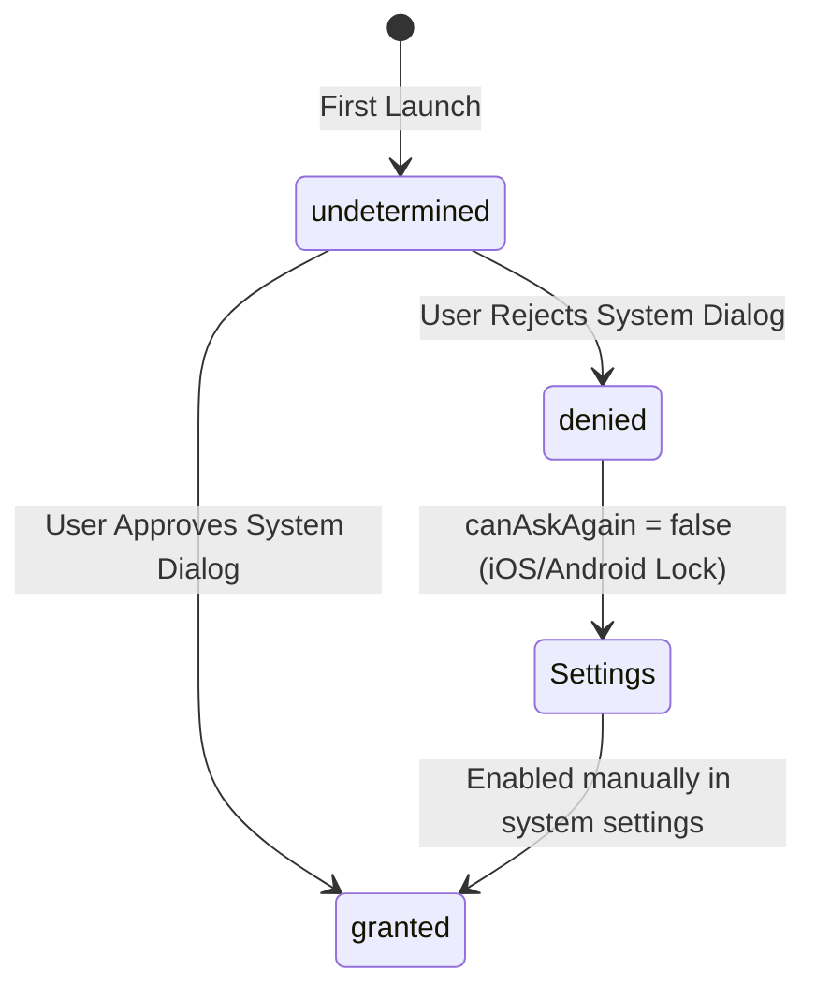
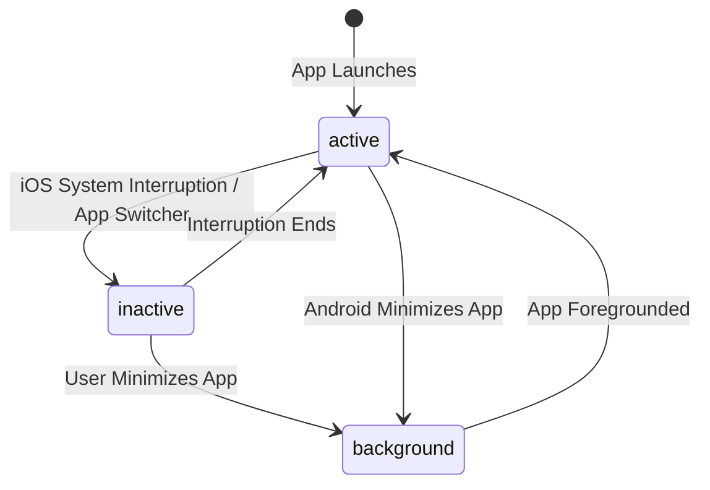

# 5.1 System Permissions and App Lifecycle

> [!abstract] TL;DR
> In modern Expo (SDK 51+), the monolithic `expo-permissions` package is deprecated. Permissions are now requested using module-specific APIs (e.g., `expo-camera`, `expo-location`). Designing a production-ready permission flow requires a custom pre-prompt (rationale screen) to prevent users from permanently denying permissions. To handle app state transitions (e.g., refreshing data on focus), developers use the native React Native `AppState` API, which mirrors but differs significantly from the web's Page Visibility API.

## Digest

For a web React developer, interacting with the operating system's hardware (camera, GPS, notifications) and managing the application's lifecycle represents a paradigm shift. In a web browser, permissions are often requested just-in-time, and background execution is highly constrained. On mobile, system permissions are strictly guarded by the operating system, and the application lifecycle has distinct states that dictate memory management and execution.

---

### Modern System Permissions in Expo (SDK 51+)

In older Expo versions, a single package called `expo-permissions` handled all OS permission requests. This approach was monolithic and bloated the application binary size.

Modern Expo uses **module-specific permission APIs** bundled directly within each feature library. For example, if your app needs the camera, you import and use permissions from `expo-camera`.

#### The Standard Permission Hook Pattern
Most Expo module-specific APIs expose a React hook with a consistent signature:

```tsx
import { useCameraPermissions } from 'expo-camera';

const [permission, requestPermission] = useCameraPermissions();
```

The `permission` object conforms to the `PermissionResponse` interface:

*   **`status`**: `'undetermined'` | `'granted'` | `'denied'`.
*   **`granted`**: A boolean convenience flag representing `status === 'granted'`.
*   **`canAskAgain`**: A boolean indicating if the OS will allow you to present the system prompt again.
*   **`expires`**: When the permission expires (rarely used on iOS/Android).



#### Android vs. iOS Permission Mechanics
1.  **iOS System Dialogs**: You can only present the official system dialog **once** per app installation. If the user selects "Don't Allow", any subsequent calls to `requestPermission` will immediately resolve with a rejected status without showing any prompt. The only way to recover is to guide the user to the iOS Settings app.
2.  **Android System Dialogs**: Android allows prompting the user again unless they check "Don't ask again" (or select "Deny" multiple times in modern Android versions, which implicitly blocks further prompts).

---

### Designing a Graceful UI Permission Flow

Because of the "one-shot" nature of iOS system permission prompts, launching the native permission prompt immediately upon app startup is a major anti-pattern. If a user rejects it, reclaiming access is difficult.

#### The Pre-Prompt (Rationale Screen) Pattern
Before triggering the native system dialog, display a custom, beautifully designed in-app modal or full-screen view (often called a **soft prompt**):
*   Explain **why** the feature is required.
*   Highlight the **benefit** the user receives (e.g., "We need location access to map your morning run").
*   Only call `requestPermission()` after the user taps a button confirming they want to proceed.

#### Handling Denied and Locked States
If `permission.granted` is false and `permission.canAskAgain` is also false, you must transition your UI to a fallback screen:
*   Show a clear instruction explaining that the permission was disabled.
*   Provide a direct CTA to open the app settings using the React Native `Linking` API.

```tsx
import { Linking } from 'react-native';

const handleOpenSettings = () => {
  Linking.openSettings();
};
```

---

### App Lifecycle: Monitoring AppState

In web React development, you might listen to `visibilitychange` to see if the user switched tabs:

```js
document.addEventListener('visibilitychange', () => {
  if (document.visibilityState === 'visible') {
    // Refresh page data
  }
});
```

On mobile, React Native provides the `AppState` API to monitor whether your application is in the foreground, background, or transitioning.

#### AppState States
*   **`active`**: The app is in the foreground, visible, and accepting user interaction.
*   **`background`**: The app is running in the background. The user is in another app, on the home screen, or the device is locked.
*   **`inactive`** (iOS-specific): The app is transitioning between active and background. This occurs during phone calls, when pulling down the notification center, or in the app switcher.



#### Mobile vs. Web Execution Differences
*   **Web**: Background tabs continue to run JavaScript, albeit with throttled timers and performance.
*   **Mobile**: When an app transitions to `background`, the operating system quickly suspends the JavaScript engine (typically within seconds). CPU cycles are zeroed, and WebSocket connections close. You cannot run long-running async loops or polling operations here without using native background fetch wrappers.
*   **Reconnection / Refetching**: Because connections drop when backgrounded, a primary use case for `AppState` is triggering data refetching or database reconciliation immediately when the app returns to the `active` state.

#### Subscribing to AppState
Always manage your subscriptions within a `useEffect` cleanup return to prevent listener accumulation:

```tsx
import { useEffect, useRef, useState } from 'react';
import { AppState, AppStateStatus } from 'react-native';

export function useAppState() {
  const appState = useRef(AppState.currentState);
  const [appStateStatus, setAppStateStatus] = useState(appState.current);

  useEffect(() => {
    const subscription = AppState.addEventListener('change', (nextAppState) => {
      appState.current = nextAppState;
      setAppStateStatus(nextAppState);
    });

    return () => {
      subscription.remove();
    };
  }, []);

  return appStateStatus;
}
```

---

## Drill

Create a custom hook and UI permission flow for a habit-tracking screen that requires access to location data (e.g., to record where a habit was completed) and reacts to the app being minimized or reopened.

### Task Description

1.  **AppState Hooks & Refetching**:
    *   Create a custom hook `useForegroundTrigger(onForeground: () => void)` that executes a callback function whenever the app transitions from `background` or `inactive` to `active`.
    *   Implement logic within the hook to store a timestamp in a React `useRef` when the app enters the `background`, and calculate/log the total seconds the user spent away from the app when they return to the `active` state.

2.  **Custom UI Permission Flow**:
    *   Design a visual flow for requesting Location permissions using `expo-location` (or mock permission structures conforming to `PermissionResponse`).
    *   The flow must support three screens:
        1.  **Rationale Screen (Soft Prompt)**: Exposes a description of why location is needed with an "Enable Location" button.
        2.  **Native Prompt Trigger**: Executed only if the user taps "Enable Location" and permissions are `undetermined`.
        3.  **Settings Fallback Screen**: Shown if permissions are denied and `canAskAgain` is false, containing a button that opens the system settings directory using `Linking.openSettings()`.

> [!example] Success criteria
> - [ ] The `AppState` listener is correctly mounted and unmounted, preventing memory leaks on component teardown.
> - [ ] The elapsed background duration is correctly calculated using timestamps and logged when the app returns to `active`.
> - [ ] The permission flow handles all three states (`undetermined`, `granted`, and permanently `denied`) without triggering the OS prompt before the user consents.

---

## Related

- Prev: [[4.3 Offline-First Architecture]]
- Next: [[5.2 Notifications and Background Tasks]]
- See also: [[learn-react-native]]
