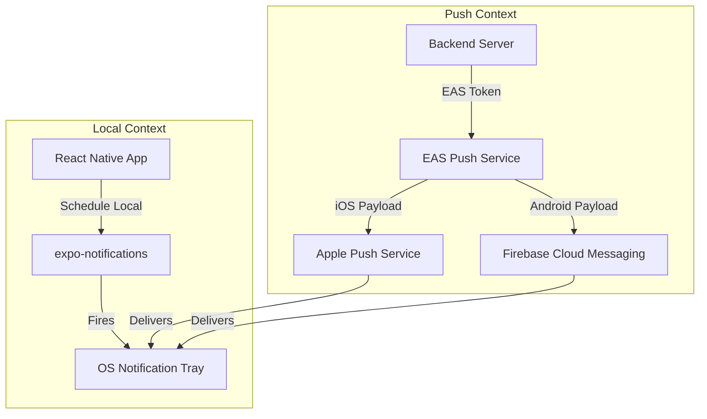
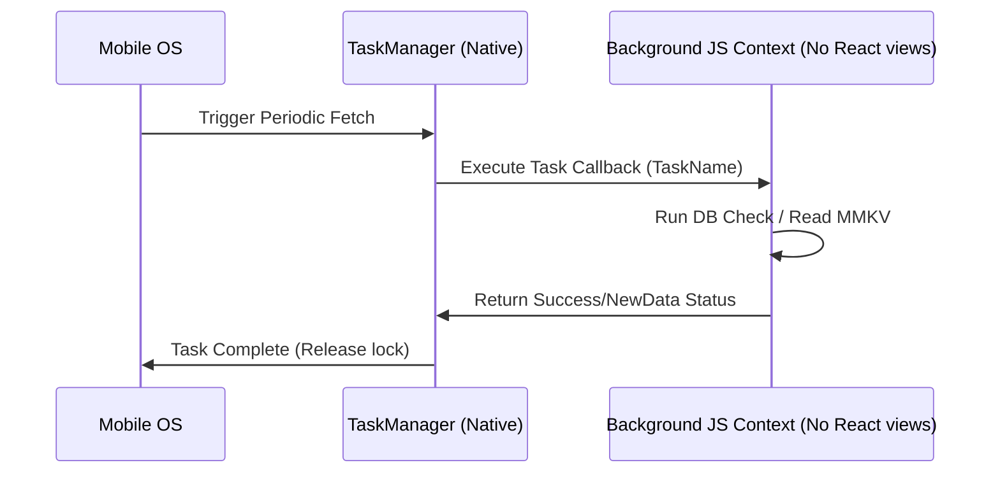
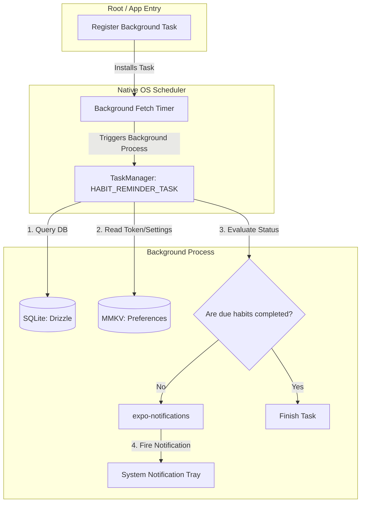

# 5.2 Notifications and Background Tasks

> [!abstract] TL;DR
> Background execution on mobile is heavily restricted compared to the web. Developers use `expo-task-manager` to define background tasks at the root scope, and schedule periodic checks with `expo-background-fetch`. For notification delivery, apps use `expo-notifications` to trigger local reminders or process push notifications from EAS/FCM/APNs. Because background threads run in separate native environments, databases and key-value stores (MMKV, SQLite) must be accessed safely outside the React component lifecycle.

## Digest

Web applications typically rely on Web Workers, Service Workers, or server-side cron jobs to process tasks. On mobile, background threads are native processes managed aggressively by the operating system. iOS and Android will instantly terminate background processes that consume too much CPU, memory, or battery. Managing background jobs requires registering native callbacks that execute even when the React app is completely closed.

---

### Notifications in Expo

Expo categorizes notifications into two types:

1.  **Local Notifications**: Scheduled and triggered entirely on the user's device (e.g., setting a reminder for 15 minutes from now). This does not require an active network connection or backend server.
2.  **Push Notifications**: Dispatched from a remote backend server, routed through the **Expo Application Services (EAS) Push Service**, Firebase Cloud Messaging (FCM) for Android, or Apple Push Notification service (APNs) for iOS, and delivered to the device.

For local notifications and handling push payloads, Expo provides the `expo-notifications` package.



#### Configuring Notification Behavior
To specify how notifications are presented (e.g., showing an alert dialog, playing a sound, or incrementing the badge count) when the app is currently in the foreground:

```tsx
import * as Notifications from 'expo-notifications';

Notifications.setNotificationHandler({
  handleNotification: async () => ({
    shouldShowAlert: true,
    shouldPlaySound: true,
    shouldSetBadge: false,
  }),
});
```

---

### Background Tasks Architecture

To execute JavaScript code in the background when the app is suspended or terminated, React Native separates background execution from the React rendering context.

#### The Root-Level Requirement
Background tasks must be registered using `expo-task-manager` at the **root scope** (e.g., in `index.js`, `App.tsx`, or `/app/_layout.tsx` outside of components).



**Why?** When the OS triggers a background fetch, it does not mount the React UI tree. It spins up a headless JavaScript execution context, loads your bundle, and expects the registered task handler to execute. If your task registration lives inside a React component's `useEffect`, the engine will never find the handler because the component is never mounted.

#### Registering a Task
Define the task handler globally:

```tsx
import * as TaskManager from 'expo-task-manager';
import * as BackgroundFetch from 'expo-background-fetch';

const MY_BACKGROUND_TASK = 'BACKGROUND_SYNC_TASK';

// Must be defined at the global root level
TaskManager.defineTask(MY_BACKGROUND_TASK, async () => {
  try {
    console.log('Background task running...');
    // Perform background operations (e.g., query DB, sync)
    return BackgroundFetch.BackgroundFetchResult.NewData;
  } catch (error) {
    return BackgroundFetch.BackgroundFetchResult.Failed;
  }
});
```

#### Scheduling Tasks with Background Fetch
`expo-background-fetch` schedules the OS to trigger your task periodically:

```tsx
async function registerTask() {
  return BackgroundFetch.registerTaskAsync(MY_BACKGROUND_TASK, {
    minimumInterval: 15 * 60, // 15 minutes (in seconds)
    stopOnTerminate: false,   // Android only: keep running after app close
    startOnBoot: true,        // Android only: keep running after device reboot
  });
}
```

---

### Platform Limitations

Operating systems prioritize device battery life and thermal health over your background tasks.

#### iOS Limitations
*   **Execution Time**: Background tasks must finish in under **30 seconds**. If they take longer, iOS will forcefully terminate the process.
*   **Trigger Control**: The `minimumInterval` is a request, not a guarantee. The iOS system uses machine learning (based on user habits, battery level, and network quality) to determine when to run your background fetch. It can choose to throttle or suspend your tasks entirely if the user rarely opens your app.
*   **Developer Device Testing**: You cannot test background fetch timing reliably on an iOS simulator by waiting. Instead, you must trigger it manually using the Debug menu in Xcode.

#### Android Limitations
*   **Battery Optimization (Doze Mode)**: When the device is stationary with the screen off, Android enters Doze Mode. Standard background fetches are batched and delayed.
*   **Manufacturer Restraints**: Many Android manufacturers (e.g., Samsung, OnePlus, Xiaomi) implement non-standard, aggressive power-saving engines that block background tasks from running unless the user manually disables battery optimizations for your app in settings.

---

### MMKV and SQLite in Background Tasks

Since the JS engine is running headless in the background, you must ensure your data layer utilities can execute safely without React context dependency.

*   **MMKV**: `react-native-mmkv` is backed by a native C++ engine with synchronous bindings. It initializes and runs instantly in background tasks.
*   **SQLite + Drizzle**: Drizzle queries can be run inside background tasks by importing your pre-configured database instance directly:

```tsx
import { db } from './db';
import { habits } from './db/schema';
import { eq } from 'drizzle-orm';

// Safe to invoke inside TaskManager.defineTask
const activeHabits = await db.select().from(habits).where(eq(habits.active, true));
```

---

## Drill

Register a background task that increments a background execution counter in MMKV and triggers a local notification alert when the count reaches specific increments.

### Task Description

1.  **Task Registration**:
    *   Define a task named `PERFORMANCE_COUNTER_TASK` using `TaskManager.defineTask`.
    *   Retrieve an MMKV instance inside the task, read a `run_count` key, increment it by 1, and write it back.
    *   Return `BackgroundFetch.BackgroundFetchResult.NewData`.
2.  **Notification Trigger**:
    *   If `run_count` is a multiple of 5 (e.g., 5, 10, 15), trigger an immediate local notification using `expo-notifications`. The notification should contain a message: `"Background task has executed X times!"`.
3.  **Scheduling Interface**:
    *   Detail a setup function `registerCounterTask()` using `expo-background-fetch` that registers the task with a minimum interval of 15 minutes.
    *   Write a corresponding cleanup function `unregisterCounterTask()` that safely removes the task registration from the device.

> [!example] Success criteria
> - [ ] Task definition is written at the global/root scope, completely isolated from any React rendering cycle.
> - [ ] The code handles retrieving and saving data to MMKV inside the background function context.
> - [ ] An immediate local notification trigger is called conditionally when the counter matches the target.
> - [ ] Proper register and unregister logic is detailed for testing.

---

## 🏗️ Capstone step: Background Reminders and Local Notifications

In this milestone, you will implement background checks to notify users if they have pending habits remaining for the day.

### System Architecture Map



### Capstone Implementation Checklist

To complete this milestone, add notification handling and background fetches to your habit tracker app:

1.  **Request Notification Permissions**:
    *   Implement an asynchronous permission request flow using `expo-notifications`.
    *   Present the request using the soft-prompt rationale screen pattern (e.g., on your settings dashboard or onboarding screen). Do not fire it immediately on app launch.

2.  **Register the Reminder Task**:
    *   At the root of your application (e.g., inside `_layout.tsx` or `index.js`), define a task named `HABIT_REMINDER_TASK` using `TaskManager.defineTask`.
    *   Ensure the background task executes the check logic safely in a headless environment.

3.  **Implement the Sync/Check Logic**:
    *   Inside `HABIT_REMINDER_TASK`:
        1.  Open the SQLite database connection.
        2.  Query all active habits due for the current day.
        3.  Check if any due habits lack completion logs (`habit_completions`) for today's date.
        4.  Read MMKV settings to confirm if notification reminders are toggled "on" in user preferences.
        5.  If there are pending habits and notifications are enabled, trigger an immediate local notification reminder (e.g., `"Don't forget! You have outstanding habits to complete today."`).
        6.  Return `BackgroundFetch.BackgroundFetchResult.NewData` if a notification was fired or data changed, otherwise return `BackgroundFetch.BackgroundFetchResult.NoData`.

4.  **Register Background Fetch**:
    *   Inside your main ViewModel or context initializers, register `HABIT_REMINDER_TASK` to execute periodically (e.g., every 1-4 hours).
    *   Verify registration status programmatically on startup.

---

## Related

- Prev: [[5.1 System Permissions and App Lifecycle]]
- Next: [[6.1 Testing React Native Components]]
- See also: [[learn-react-native]]
