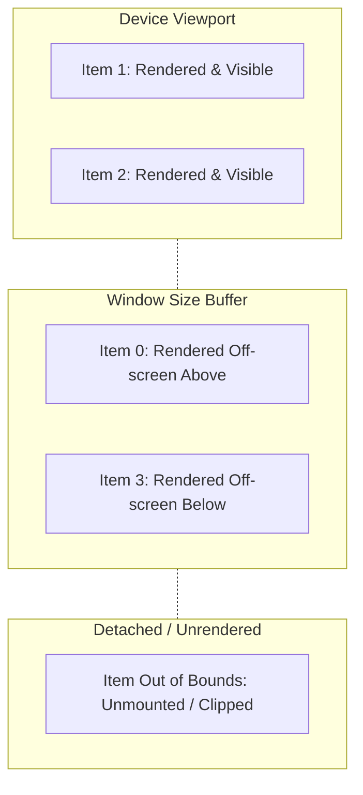
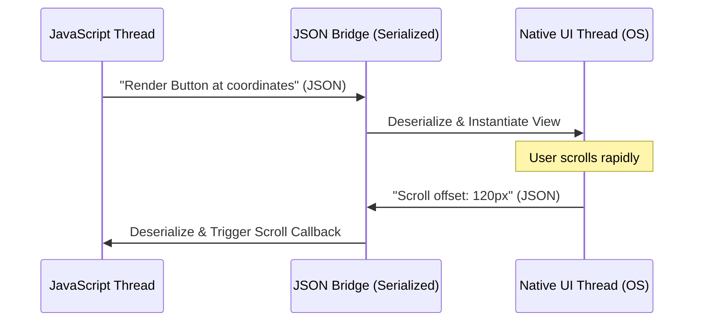

# 6.2 Performance Tuning

> [!abstract] TL;DR
> Mobile applications run on hardware constraints far stricter than modern desktop web browsers. Performance optimization in React Native requires understanding the JS-Native Bridge bottleneck, leveraging Hermes bytecode pre-compilation, and ensuring component reference stability using `useCallback` and `useMemo`. When rendering infinite lists, configuring `<FlatList>` layout properties like `getItemLayout`, `windowSize`, and `initialNumToRender` is critical to prevent layout-thrashing and memory starvation.

## Digest

Web developers are accustomed to the modern browser's V8 JIT engine, which runs on devices with ample RAM and active cooling. In React Native, your JavaScript runs on a single thread alongside native threads. Performance issues manifest not just as slow calculations, but as dropped frames (stuttering animations), delayed touch responses, and operating system termination due to memory spikes.

---

### Identifying Bottlenecks with React DevTools Profiler

Before optimizing, you must measure. React DevTools Profiler allows you to record the render cycle of your application and inspect the cost of each component.

#### 1. Connecting the Profiler
*   Run the app in development mode.
*   Open the React DevTools standalone app or use Flipper's React DevTools plugin.
*   Click the **Record** button, perform the slow user action (e.g., scroll a list or toggle tabs), and click **Stop**.

#### 2. Analyzing the Data
*   **Flame Chart**: Shows the state of your component tree for each commit. Taller/wider bars indicate elements that took longer to render.
*   **Ranked Chart**: Sorts components by the absolute time they took to render in the selected render pass.
*   **Rerender Reasons**: Clicking on a component reveals *why* it rendered (e.g., "Props changed: `onPress`"). This is the key to identifying reference instability.

---

### FlatList Rendering Optimizations

The standard `<ScrollView>` renders all children instantly, even if they are far off-screen. For large datasets, this leads to immediate memory crashes. `<FlatList>` renders items lazily, but it requires careful tuning to maintain 60 FPS (or 120 FPS) scrolling.



#### Key Optimization Props

1.  **`getItemLayout` (Crucial)**
    By default, FlatList measures the layout height of every item dynamically after it is rendered on the screen. This causes dynamic style calculations during scrolling. If your list items have a fixed size, pass `getItemLayout` to bypass this computation:
    ```tsx
    getItemLayout={(data, index) => ({
      length: ITEM_HEIGHT,
      offset: ITEM_HEIGHT * index,
      index,
    })}
    ```
    *Bypassing dynamic measurement yields a 10x performance improvement for long lists.*

2.  **`initialNumToRender`**
    Specify the exact number of items needed to fill the initial screen. Rendering too many at start-up delays the screen transition, while rendering too few causes visible blank spaces.

3.  **`windowSize`**
    Defines the maximum number of items rendered outside the viewport. The value is expressed in units of viewport heights (where `1` is the current screen). The default is `21` (10 screens above, 10 screens below, 1 active screen). For heavy list cells, reduce this to `5` or `7` to reclaim memory.

4.  **`removeClippedSubviews`**
    When set to `true`, native views that are scrolled out of bounds are detached from the native view hierarchy, reducing the layout workload of the OS parent view.

5.  **`keyExtractor`**
    Always supply a stable, unique identifier (like an ID string from a database). Avoid using the array `index` as a key, as inserting or removing list items forces React to re-evaluate and rerender every single item in the list.

---

### Reference Stability: Memoization vs. Inline Code

Even if your list layout properties are tuned, inline function declarations or inline object definitions inside render blocks will trigger complete component trees to rerender on every parent state update.

#### The Problem: Inline Functions
```tsx
// Anti-Pattern: Triggers rerender on every parent change
<FlatList
  data={habits}
  renderItem={({ item }) => (
    <HabitRow item={item} onPress={() => handlePress(item.id)} />
  )}
/>
```
Every time the parent component rerenders, a new instance of the anonymous arrow function `() => handlePress(item.id)` is instantiated. Even if `HabitRow` is wrapped in `React.memo()`, it will detect a brand-new reference in its `onPress` prop and execute a full render cycle.

#### The Solution: Reference Stability
To maintain reference equality, extract callbacks and component definitions:

```tsx
import React, { useCallback, useMemo } from 'react';

// 1. Memoize individual rows
const HabitRow = React.memo(({ item, onPress }: { item: Habit; onPress: (id: string) => void }) => {
  return <HabitRowUI item={item} onPress={onPress} />;
});

// 2. In parent: Memoize the click handler callback
const handleToggle = useCallback((id: string) => {
  toggleHabitStatus(id);
}, []);

// 3. In parent: Memoize the rendering function reference
const renderItem = useCallback(({ item }: { item: Habit }) => (
  <HabitRow item={item} onPress={handleToggle} />
), [handleToggle]);
```

---

### The JS-Native Bridge Bottleneck

In React Native's traditional architecture, JavaScript and Native code (Objective-C/Java) reside in isolated sandboxes and communicate asynchronously by sending serialized JSON payloads over a logical bridge.



#### Optimization Rules for Bridge Traffic
*   **Avoid High-Frequency Syncs**: Do not pass high-frequency events (like scroll positions or raw touches) from the native side to the JS thread just to update styling.
*   **Move Animations Off-Thread**: Use libraries like `react-native-reanimated` which declare animation physics on the JS thread but execute them directly on the native UI thread using compiled "worklets".
*   **Synchronous Native Calls (JSI)**: Use modern modules backed by the C++ JavaScript Interface (JSI) like `react-native-mmkv`. JSI allows JavaScript to invoke native functions directly without JSON serialization overhead.

---

### Hermes JavaScript Engine

Hermes is an open-source JavaScript engine optimized by Meta for running React Native on mobile devices.

*   **Bytecode Pre-compilation**: Traditional engines load JavaScript source code and compile it to machine code at runtime (JIT). Hermes compiles JavaScript into optimized bytecode at app build-time.
*   **Startup Speed**: By loading pre-compiled bytecode, the application does not spend initial CPU cycles parsing code, resulting in immediate app boot-up.
*   **GC Architecture**: Hermes features a generational garbage collector designed to avoid pause-interrupts on mobile devices, keeping garbage collection sweeps small and non-blocking.

---

### Memory Leak Identification

Memory leaks occur when components retain references to objects after the component has unmounted, leading to high resource allocation and eventual device crash (Out of Memory).

#### Common Culprits
1.  **Uncleaned Subscriptions**: Adding event listeners (`AppState.addEventListener`, `DeviceEventEmitter`) without returning cleanups.
2.  **Timers**: Starting `setInterval` loops that continue executing on closed screens.
3.  **Database Connection Leaks**: Opening SQLite instances inside helper files without reusing singletons, exhausting local file handles.

---

## Drill

Analyze a performance degradation report for a scrollable activity log screen and detail a diagnostic and optimization strategy.

### Task Description

1.  **Profiling Setup**:
    *   Detail the steps required to connect the React DevTools Profiler to a dev client.
    *   Describe how you would isolate and verify that a slow scroll interaction is caused by rendering cycles, rather than slow database execution.
2.  **FlatList Tuning Strategy**:
    *   Given an activity feed list containing thousands of entries with rich visual elements (avatars, text comments, timestamps):
        *   Formulate how to set `initialNumToRender` and `windowSize` to limit active memory usage.
        *   Provide the design of `getItemLayout` for items with fixed heights (e.g., `80px`) and explain why this bypasses native measurement calculations.
3.  **Reference Optimization Draft**:
    *   Analyze a provided sample code block containing inline arrow functions and state dependencies inside a list renderer.
    *   Detail the code changes required to memoize the render item function and child cell components, explaining how these changes achieve reference stability and prevent unnecessary rerenders.

> [!example] Success criteria
> - [ ] FlatList optimization properties (`getItemLayout`, `windowSize`, `initialNumToRender`) are explained.
> - [ ] Reference stability using `useCallback` is detailed.
> - [ ] Explains bridge traffic reduction principles.
> - [ ] No worked solution code in the drill.

---

## Related

- Prev: [[6.1 Testing React Native Components]]
- Next: [[7.1 EAS Build and Dev Clients]]
- See also: [[learn-react-native]]
