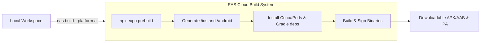

# 7.1 EAS Build and Dev Clients

> [!abstract] TL;DR
> Traditional web applications ship text assets directly to browsers. React Native applications, however, compile into platform-specific binary bundles containing native runtimes. Expo Application Services (EAS) Build moves compilation from fragile local machines to clean remote cloud instances. By transitioning from Expo Go (which uses a rigid, pre-packaged native runtime) to Custom Development Clients (`expo-dev-client`), developers can dynamically configure native code via Config Plugins and run custom native modules on devices or simulators while retaining the fast-reload development experience of the web.

## Digest

In web development, the boundary between your source code and the execution environment is absolute: you deliver HTML, CSS, and JS, and the browser executes it. In React Native, your JS code runs inside a native wrapper. Adding a native package (like a fast key-value store or a custom biometric login framework) modifies the underlying C++, Swift/Objective-C, or Java/Kotlin binary itself.

### The Compilation Dilemma: Local vs. Cloud Builds

Building mobile application binaries (`.apk` or `.aab` for Android, `.ipa` for iOS) historically required a complex local native toolchain:
*   **iOS**: Xcode, macOS, Cocoapods, provisioning profiles, Apple signing certificates, and hardware matching target architectures.
*   **Android**: Android Studio, Gradle, JDK, Android SDKs, and platform build tools.

**EAS Build** solves this by abstracting local environments. It spins up clean, isolated cloud virtual machines (macOS and Linux instances) configured with the correct SDK and toolchain versions.



---

### Expo Go vs. Development Clients

For initial prototyping, developers use the pre-compiled **Expo Go** application from the App Store or Play Store. However, Expo Go has strict limitations:

| Capability / Feature | Expo Go | Custom Development Client (`expo-dev-client`) |
| :--- | :--- | :--- |
| **Native Runtime** | Pre-bundled with a fixed set of Expo SDK libraries. | Built from your project's exact dependency tree. |
| **Custom Native Code** | Forbidden. Cannot include custom Swift/Kotlin or custom modules. | Fully supported. Any React Native module can be compiled in. |
| **Ad-Hoc Testing** | Works immediately out of the box via QR code scanning. | Requires a one-time binary build and install on device. |
| **Performance Sync** | Slower due to debugging bridges built into the pre-compiled app. | Matches production-grade JS engine setups (Hermes). |
| **Workflow** | Load JS-only changes directly. | Load JS changes directly *until* native dependencies change. |

When you install a custom package with native code (e.g. `react-native-mmkv` or `expo-secure-store`), Expo Go will crash when calling these modules because their compiled native binaries are missing from the pre-built Expo Go app. Creating a **Custom Development Client** compiles these modules into a custom test harness runner that replaces Expo Go for your project.

---

### Dynamic Prebuild Configuration (`prebuild`)

Expo applications exist in two states: **Managed** (no `/ios` or `/android` folders in source control) and **Bare** (native folders checked into git). Modern Expo uses **Continuous Native Generation (CNG)**:

1.  **Source of Truth**: All configurations (app name, icons, bundle identifiers, permissions, config plugins) are declared in `app.json` or `app.config.js`.
2.  **On-the-Fly Generation**: Running `npx expo prebuild` reads this JSON structure and generates fully functional `/ios` and `/android` directories.
3.  **Config Plugins**: These are JavaScript functions run during `prebuild` that modify iOS `.plist` / `.pbxproj` files and Android `.gradle` / Manifest files programmatically.

> [!IMPORTANT]
> Never modify files inside the `/ios` or `/android` folders directly if you are using CNG. Instead, write or configure Config Plugins in `app.json` so that your changes are reproducible across cloud builds.

---

### Credential Management

Before a mobile operating system installs an application, the binary must be signed with cryptographic keys certifying its origin.

#### Android Credentials
Android binaries require a **Keystore**:
*   A binary file (`.jks` or `.keystore`) containing a private key.
*   Required values: Keystore password, Key alias, and Key password.
*   EAS can generate these automatically, storing them encrypted in the EAS Cloud database.

#### iOS Credentials
iOS requires a strict, multi-step signing hierarchy governed by Apple:
1.  **Apple Distribution/Development Certificates**: Establishes identity (who built the app).
2.  **App ID**: Uniquely identifies the app in Apple's ecosystem (e.g. `com.company.appname`).
3.  **Provisioning Profile**: A profile generated by Apple linking the App ID, the allowed Certificates, and a list of specific device UDIDs (for Ad-Hoc development builds).
4.  **EAS Credentials**: EAS logs into your Apple Developer Portal (via session tokens) to generate, renew, and register these certificates on the fly.

---

### `eas.json` Profiles Structure

The `eas.json` file configures your build configurations. It contains three main blocks: `cli`, `build`, and `submit`.

```json
{
  "cli": {
    "version": ">= 9.0.0"
  },
  "build": {
    "development": {
      "developmentClient": true,
      "distribution": "internal"
    },
    "staging": {
      "developmentClient": true,
      "distribution": "internal"
    },
    "production": {
      "distribution": "store"
    }
  }
}
```

#### Configuration Properties
*   `developmentClient`: When set to `true`, compiles the `expo-dev-client` library into the binary. This bundle will start a developer server menu instead of immediately trying to run a production JS bundle.
*   `distribution`: Specifies how the build is distributed (`store` for App Store/Play Store, `internal` for ad-hoc device installations using provisioning profiles/APK downloads).
*   `ios.simulator`: Builds specifically for x86_64 or ARM64 iOS simulators (produces a `.app` tarball instead of a `.ipa` package designed for physical devices).

---

## Drill

Create a configuration draft and build execution outline for a React Native application moving from Expo Go to custom development clients.

### Task Description

1.  **`eas.json` Schema Design**:
    *   Draft an `eas.json` file in the root of the workspace.
    *   Create three profiles:
        *   `development`: Configured for simulator usage on both iOS and Android, ensuring it runs as a dev client with native developer tools enabled.
        *   `staging`: Configured for internal distribution to physical QA devices (Ad-Hoc for iOS, APK link distribution for Android).
        *   `production`: Configured to output production-ready store binaries (`.aab` for Android, store-ready `.ipa` for iOS) with optimal build configurations.
    *   Ensure proper configuration of key flags: `developmentClient`, `distribution`, and platform-specific options like `simulator`.

2.  **CLI Command Outline**:
    *   Document the precise command to log in to EAS CLI and initialize the project link.
    *   Specify the commands to trigger a local development build (building on your own workstation) for Android and iOS.
    *   Specify the commands to trigger an EAS-hosted cloud development build for physical device testing.

3.  **Config Plugin Scenario**:
    *   Explain how to configure a custom camera permission string in `app.json` so that Expo Prebuild automatically adds the permission description to the iOS `Info.plist` and Android `AndroidManifest.xml` files.

> [!example] Success criteria
> - [ ] `eas.json` structure with 3 profiles (development, staging, production) is defined.
> - [ ] Commands to build custom dev client and local builds are outlined.
> - [ ] The difference between Expo Go and development client is clearly explained.
> - [ ] No worked solution code in the drill.

---

## Related

- Prev: [[6.2 Performance Tuning]]
- Next: [[7.2 EAS Submit and Expo Updates]]
- See also: [[learn-react-native]]
