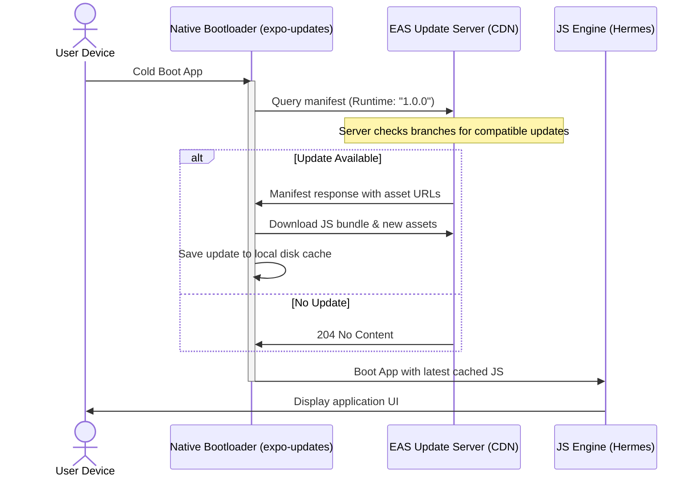

# 7.2 EAS Submit and Expo Updates

> [!abstract] TL;DR
> Publishing updates via the App Store and Google Play Store requires days of review and binary rebuilds. Over-The-Air (OTA) updates allow you to deliver critical bug fixes and JavaScript code enhancements directly to user devices in seconds, bypassing store review entirely. Expo Updates intercepts app boot-up, queries a central update server, determines native runtime compatibility via version gating, downloads updated JavaScript/assets, and performs hot swaps. For complete binary changes (native code updates), EAS Submit automates store delivery directly from cloud build pipelines.

## Digest

Web applications deploy new versions simply by updating static assets on a CDN. Users reload their browsers and receive the latest build. Native mobile applications, however, are packaged into compiled binaries and distributed through central app stores. 

To bridge this gap, React Native separates the compiled **Native Code Runtime** from the dynamic **JavaScript Bundle & Assets**. Over-The-Air (OTA) updates allow you to push JavaScript and asset updates directly to user devices, while native changes still require store submissions.

---

### EAS Submit: Store Submission Automation

Manually exporting binaries from Xcode or Gradle, uploading them via Transporter or the web console, and setting up metadata is an error-prone process. **EAS Submit** automates this workflow.

*   **App Store Connect Integration**: Authenticates with Apple using an App Store Connect API Key to upload `.ipa` files directly to TestFlight or Production.
*   **Google Play Console Integration**: Authenticates with Google using a Service Account JSON key to upload `.aab` (Android App Bundle) binaries directly to internal testing tracks or production releases.
*   **Pipeline Chaining**: Can be triggered automatically following a successful cloud build:
    ```bash
    eas build --platform all --profile production --auto-submit
    ```

---

### Expo Updates Architecture

The **`expo-updates`** library handles OTA updates. It manages client-side caching, contacts update servers, and swaps bundle contents safely.



#### The Boot Interception & Execution Lifecycle

1.  **Boot Interception**: When the OS launches the app, the native bootloader intercepts the startup sequence.
2.  **Manifest Query**: It sends a request to the EAS Update server with the local native target signature (e.g., native SDK version, `runtimeVersion`).
3.  **Version Gating (Safety Guard)**: The update server will **only** serve updates whose JS bundle relies on a matching runtime version. If you added a new native module (e.g., a bluetooth package) and published an update, an older binary on a user's phone would skip downloading it, preventing a runtime crash due to missing native libraries.
4.  **Download Strategy**:
    *   **Foreground Download (`checkOnLaunch: "ALWAYS"`)**: The app blocks user interaction while downloading the new update, running the new code immediately. Good for critical patches but can delay startup.
    *   **Background Download (`checkOnLaunch: "NEVER"` or custom timeout)**: The app launches immediately using the cached bundle. It fetches the new update in the background and applies it on the next cold launch.
5.  **Runtime Loading**: The bootloader initializes the JavaScript engine (Hermes) pointed at the local path of the newest validated JavaScript bundle.

---

### Configuring `app.json` for Expo Updates

To enable OTA updates, configure the `updates` block and target compatibility (`runtimeVersion`) in your `app.json`:

```json
{
  "expo": {
    "name": "HabitTracker",
    "slug": "habit-tracker",
    "runtimeVersion": {
      "policy": "fingerprint"
    },
    "updates": {
      "url": "https://u.expo.dev/your-project-uuid",
      "enabled": true,
      "checkOnLaunch": "ALWAYS",
      "fallbackToCacheTimeout": 3000
    }
  }
}
```

#### Key Configuration Keys
*   **`runtimeVersion`**: Links a build's Javascript bundle with its exact native code requirements. Using `"policy": "fingerprint"` dynamically hashes native configuration, dependency configurations, and code files. A JS bundle will only download if the binary's fingerprint hash matches, completely preventing native incompatibilities.
*   **`updates.url`**: The endpoint hosted on EAS CDN that hosts manifests and compiled JS bundles.
*   **`updates.checkOnLaunch`**: Dictates the check policy. Options include `"ALWAYS"` (queries server on every boot) and `"NEVER"` (no boot queries; queries must be run programmatically via the `expo-updates` client SDK).
*   **`updates.fallbackToCacheTimeout`**: The limit (in milliseconds) the app blocks on boot waiting for a network response from the update server before timing out and running the cached version. Setting this to `0` enables background download behavior, starting the cached app instantly.

---

### Channels, Branches, and Rollbacks

Expo Updates organizes deployment using git-like environments:

*   **Branch**: A chronological stream of published updates (e.g., `main`, `release-v1`).
*   **Channel**: A static target name embedded inside the native binary configuration (e.g., `production`, `staging`). Native binaries request updates from their configured channel.
*   **Channel-Branch Link**: You map a channel to a branch. For instance, you can link the `production` channel to the `main` branch. 
*   **Rollbacks**: If a bug is published, you can roll back the environment instantly by pointing the channel back to an older branch, or republishing a previous stable commit.

---

## Drill

Configure update pathways and update-safety mechanisms inside an Expo application configuration.

### Task Description

1.  **`app.json` Updates block**:
    *   Specify how to configure the `updates` object in `app.json`.
    *   Set the updates endpoint to use the EAS Updates URL.
    *   Configure the check-on-launch behaviors for development vs. production profiles.
    *   Declare a robust `runtimeVersion` configuration scheme (e.g. using fingerprinting or a fixed app version matching policy) and explain why a static version policy protects users.

2.  **EAS CLI Update Commands**:
    *   Outline the commands to initialize the EAS update configuration in your project.
    *   Detail the CLI command to publish a JS-only update to a `staging` branch.
    *   Explain how to inspect published update history and how to promote a build from the `staging` branch to the `production` branch without rebuilding the JS bundle.

> [!example] Success criteria
> - [ ] Configuration keys in `app.json` (`updates` block) are specified.
> - [ ] CLI commands for OTA publication are detailed.
> - [ ] The OTA update download/execution lifecycle is explained.
> - [ ] No worked solution code in the drill.

---

## 🏗️ Capstone step: Cloud Builds & Live Updates

In this final milestone, you will configure EAS, build a custom development client, run it on a device or emulator, and publish a live hot-patched update to verify your pipeline.

### Step-by-Step Capstone Workflow

#### 1. Setup EAS Configuration
*   Initialize your EAS project:
    ```bash
    eas project:init
    ```
*   Ensure your `eas.json` has a `development` build profile configured for dev clients, and `app.json` contains a `runtimeVersion` configuration.

#### 2. Install Native Dependencies
*   Add the necessary libraries for dev clients and OTA updates:
    ```bash
    npx expo install expo-updates expo-dev-client
    ```

#### 3. Build & Install the Development Client
*   Generate a native development client binary for your device/simulator. For Android simulators:
    ```bash
    eas build --profile development --platform android --local
    ```
    *(Omit `--local` to build on EAS remote servers if your local environment lacks native tools).*
*   Install the resulting binary (`.apk` or `.app` tarball) onto your virtual or physical testing device.

#### 4. Run the Dev Server and Boot the Client
*   Start your local bundler:
    ```bash
    npx expo start --dev-client
    ```
*   Open the custom development client on your device, and connect to the local packager. Verify the app runs and data persistence (MMKV, SQLite) is functional.

#### 5. Introduce a Visual Modification
*   In your app, make a visible modification to the Home view (e.g. change the app bar background color or add a text label saying `"V2 OTA Build"`).
*   Save the file. Check that the dev client updates via Fast Reload.

#### 6. Publish an EAS Update
*   Close the local development packager.
*   Publish your JavaScript and asset change to the EAS update servers:
    ```bash
    eas update --branch development --message "Visual update test"
    ```

#### 7. Verify the OTA Update Download
*   Kill the application process on your device/simulator.
*   Relaunch the application. Depending on your `checkOnLaunch` configuration:
    *   If configured to run in the background, you will see the old visual layout. Close the application completely, open it a second time, and verify the new layout appears.
    *   If configured to run in the foreground, verify the update applies on the initial load.

---

## Related

- Prev: [[7.1 EAS Build and Dev Clients]]
- See also: [[learn-react-native]]
