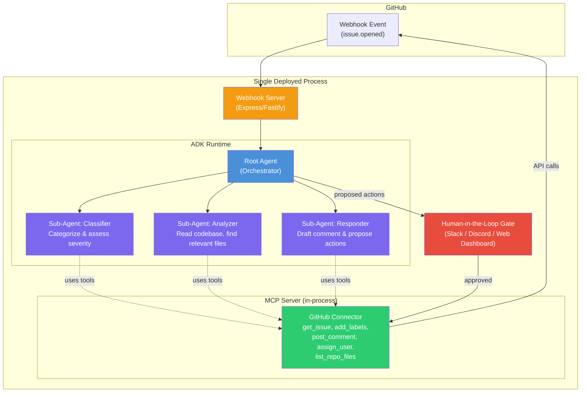
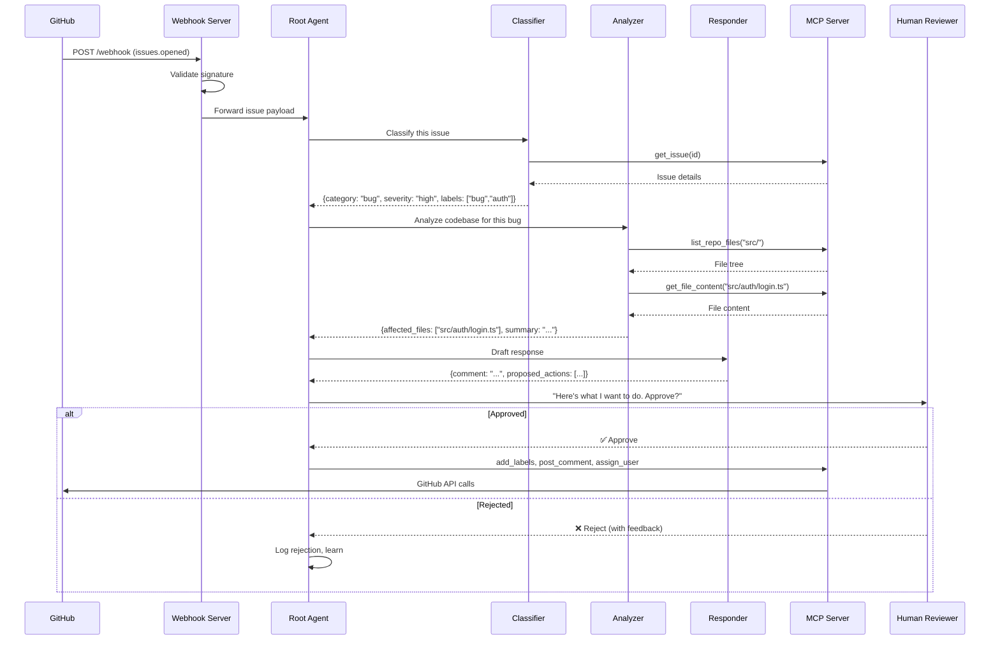
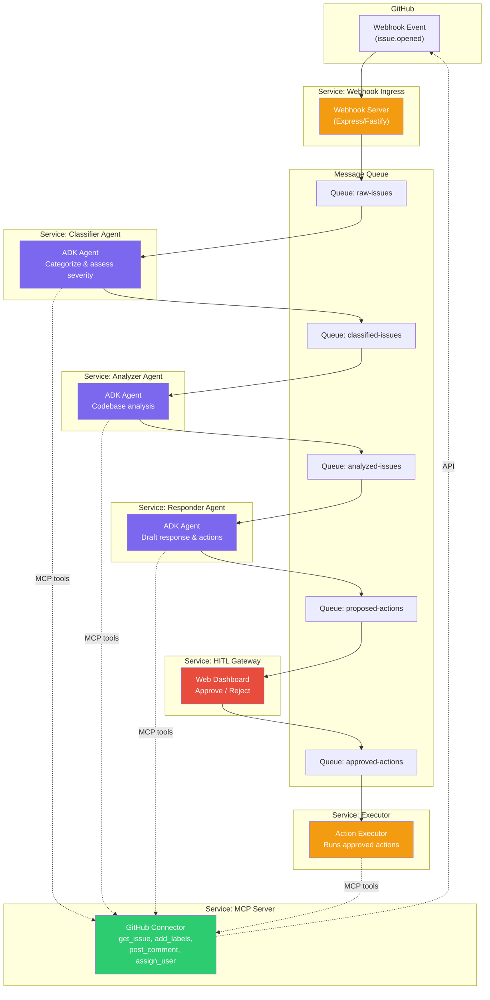
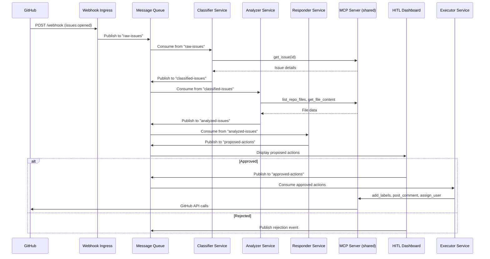

# Architecture Approaches Comparison

> [!abstract] TL;DR
> Two architecture approaches for the Auto-Triage agent compared side-by-side. Approach A (Monolith with ADK sub-agents) is recommended for the 4-day hackathon timeline. Approach B (Microservice pipeline) is more architecturally impressive but carries significant timeline risk.

## Approach A: Monolith Agent with MCP Tools

### Overview
A single process hosts everything: a webhook server, the ADK root agent with sub-agents, and the MCP server. The root agent acts as an **orchestrator** — it receives a new issue event, delegates to specialized sub-agents, collects their outputs, and gates final action behind a human approval step.

### Architecture Diagram

### Components

| Component | Role | Tech |
|-----------|------|------|
| **Webhook Server** | Listens for `issues.opened` events from GitHub, validates the webhook signature, and hands the payload to the root agent. | Express or Fastify |
| **Root Agent (Orchestrator)** | The ADK entry point. Receives the issue payload, delegates to sub-agents in sequence, collects their outputs, and assembles the final proposed action set. | `@google/adk` Agent |
| **Classifier Sub-Agent** | Reads the issue title + body. Outputs: category (`bug`, `feature`, `question`, `docs`), severity (`critical`, `high`, `medium`, `low`), and suggested labels. | ADK Sub-Agent |
| **Analyzer Sub-Agent** | If the issue is a `bug` or `feature`, this agent uses MCP tools to list repository files, read relevant source code, and identify which files/modules are likely affected. | ADK Sub-Agent |
| **Responder Sub-Agent** | Takes the Classifier and Analyzer outputs. Drafts a helpful comment for the issue (e.g., "This looks like a high-severity bug in `src/auth/login.ts`. Suggested assignee: @alice."). Also proposes the set of API actions (add labels, assign user, post comment). | ADK Sub-Agent |
| **MCP Server** | Exposes GitHub API operations as MCP tools. This is the abstraction layer — swap the connector for Jira/GitLab support without touching the agents. | Custom MCP Server (TypeScript) |
| **Human-in-the-Loop Gate** | Before executing any proposed actions, the agent sends a summary to a Slack channel, Discord bot, or simple web dashboard. A human reviews and clicks Approve/Reject. An override flag allows full-auto mode. | Slack Webhook / Discord Bot / Web UI |

### Data Flow

### Pros
- **Fast to build** — one process, one deployment, shared memory between agents
- **Easy to demo** — spin up one container locally or on Cloud Run, point a GitHub webhook at it, done
- **Simple debugging** — all logs in one place, step through the entire flow
- **Lower infrastructure cost** — no message queues, no service discovery
- **Sub-agents still satisfy "multi-agent" requirement** — ADK sub-agents are real agents with their own prompts and tool access

### Cons
- **Single point of failure** — if the process crashes, everything stops
- **No independent scaling** — can't scale the Analyzer independently if it's the bottleneck
- **Tight coupling risk** — without discipline, agents can bleed into each other's responsibilities
- **Concurrency limits** — processing multiple webhook events simultaneously requires careful async handling within one process

### Timeline Estimate (4 days)

| Day | Milestone |
|-----|-----------|
| Day 1 | MCP Server + Webhook Server scaffolding, GitHub connector tools |
| Day 2 | ADK agents (Classifier, Analyzer, Responder), orchestration logic |
| Day 3 | Human-in-the-loop gate, end-to-end testing, deployment (Docker/Cloud Run) |
| Day 4 | Polish, README, Kaggle Writeup, record YouTube video |

---

## Approach B: Microservice Agent Pipeline

### Overview
Each agent is an **independent service** with its own process. A **message queue** (Redis Streams, Google Pub/Sub, or BullMQ) connects them in a pipeline. The MCP server is also a standalone service. This creates a true distributed multi-agent system where each agent can be developed, deployed, and scaled independently.

### Architecture Diagram

### Components

| Component | Role | Tech |
|-----------|------|------|
| **Webhook Ingress Service** | Receives GitHub webhook events, validates them, and publishes raw issue payloads to the `raw-issues` queue. | Express + BullMQ / Pub/Sub publisher |
| **Classifier Agent Service** | Subscribes to `raw-issues`. Classifies the issue and publishes enriched payload to `classified-issues`. | Standalone ADK agent process |
| **Analyzer Agent Service** | Subscribes to `classified-issues`. For bugs/features, uses MCP tools to read the codebase. Publishes to `analyzed-issues`. | Standalone ADK agent process |
| **Responder Agent Service** | Subscribes to `analyzed-issues`. Drafts a comment and assembles proposed actions. Publishes to `proposed-actions`. | Standalone ADK agent process |
| **HITL Gateway Service** | Web dashboard that displays proposed actions from `proposed-actions`. On approval, publishes to `approved-actions`. | Web app (React / simple HTML) |
| **Executor Service** | Subscribes to `approved-actions`. Calls MCP tools to execute the approved actions on GitHub. | Worker process |
| **MCP Server Service** | Standalone MCP server. All agent services connect to it as a shared dependency. | Custom MCP Server (TypeScript) |

### Data Flow

### Pros
- **True distributed multi-agent** — each agent is genuinely independent, architecturally impressive
- **Independent scaling** — scale the Analyzer to 5 replicas if it's the bottleneck while Classifier stays at 1
- **Fault isolation** — if the Analyzer crashes, the Classifier and Responder keep running; messages queue up
- **Impressive architecture for judges** — the diagram and infrastructure story are strong
- **Real-world production pattern** — this is how companies actually build agent pipelines at scale

### Cons
- **Significantly more infrastructure** — need a message queue (Redis/Pub/Sub), multiple deployments, service discovery
- **Harder to develop locally** — running 6+ services during development requires Docker Compose or similar
- **More boilerplate** — each service needs its own entry point, health checks, queue consumers, error handling
- **Debugging is harder** — tracing a single issue through 5 queues and 6 services requires distributed tracing
- **Overkill for hackathon scope** — the added complexity doesn't translate to a better user experience for the demo
- **Timeline risk** — high chance of not finishing in 4 days if any service has integration issues

### Timeline Estimate (4 days)

| Day | Milestone |
|-----|-----------|
| Day 1 | MCP Server service, Message Queue setup, Webhook Ingress service, Docker Compose scaffolding |
| Day 2 | Classifier + Analyzer + Responder agent services, queue integration |
| Day 3 | HITL Dashboard, Executor service, end-to-end integration testing |
| Day 4 | Deployment, README, Kaggle Writeup, YouTube video |

> [!warning]
> This timeline has **no buffer**. If queue integration or inter-service communication has issues on Day 2, Days 3–4 get compressed. The documentation and video (worth 40 points combined) could suffer.

---

## Head-to-Head Comparison

| Dimension | Approach A (Monolith) | Approach B (Microservice) |
|-----------|----------------------|--------------------------|
| **Build time** | ~2.5 days for core | ~3.5 days for core |
| **Polish buffer** | ~1.5 days | ~0.5 days |
| **Architecture impressiveness** | Good — sub-agents within ADK | Excellent — true distributed pipeline |
| **Demo reliability** | High — one process to manage | Medium — multiple services must all work |
| **Local development** | Easy — `npm run dev` | Complex — Docker Compose + multiple terminals |
| **"Multi-agent" requirement** | ✅ ADK sub-agents | ✅ Independent agent services |
| **"MCP Server" requirement** | ✅ In-process MCP server | ✅ Standalone MCP service |
| **"Security" requirement** | ✅ HITL gate | ✅ HITL gateway service |
| **"Deployability" requirement** | ✅ Single container on Cloud Run | ✅ Multi-container on Cloud Run / K8s |
| **Risk of incomplete submission** | Low | Medium-High |
| **Code quality potential** | Higher (more time to polish) | Lower (more time fighting infra) |
| **Documentation quality** | Higher (more time to write) | Lower (same reason) |
| **Production-readiness story** | "Ship fast, scale later" | "Built for scale from day one" |

## Why it is this way

The two approaches represent the classic monolith-vs-microservice trade-off applied to AI agent systems. The monolith is not "worse" — it's the right tool for a time-constrained hackathon where polish and documentation carry 40% of the score. The microservice approach would shine in a longer competition or production setting.

## Recommendation

> [!important]
> **Approach A (Monolith)** is the pragmatic choice for a 4-day hackathon. It satisfies all 4 key concepts identically, leaves significant buffer for documentation (20 pts) and the video (10 pts), and is far more likely to result in a polished, working demo. The judges score on *meaningful use of agents* (50 pts for technical implementation), not on infrastructure complexity.

Choose Approach B only if you are very confident in your infra/DevOps speed and are willing to trade polish for architectural ambition.

## Related

- [[competition-rules]] - Requirements this design must satisfy
- [[ideation]] - Original brainstormed concepts
- [[vibecoding-capstone]] - Project MOC
